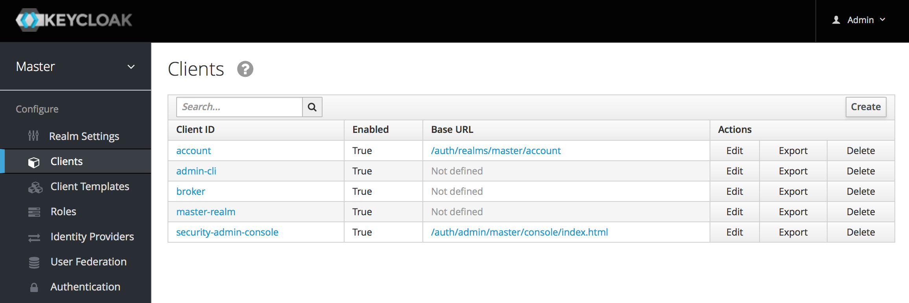
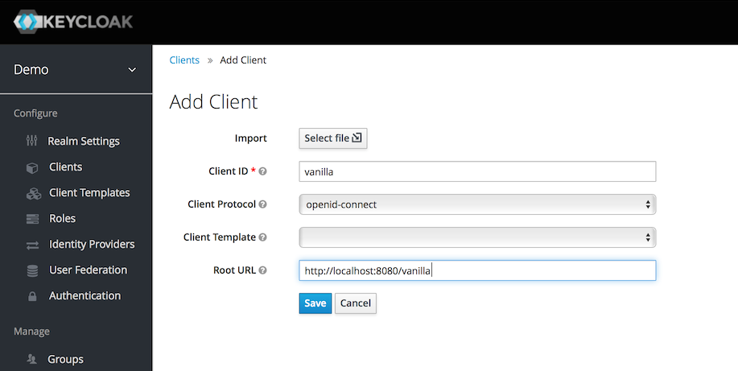
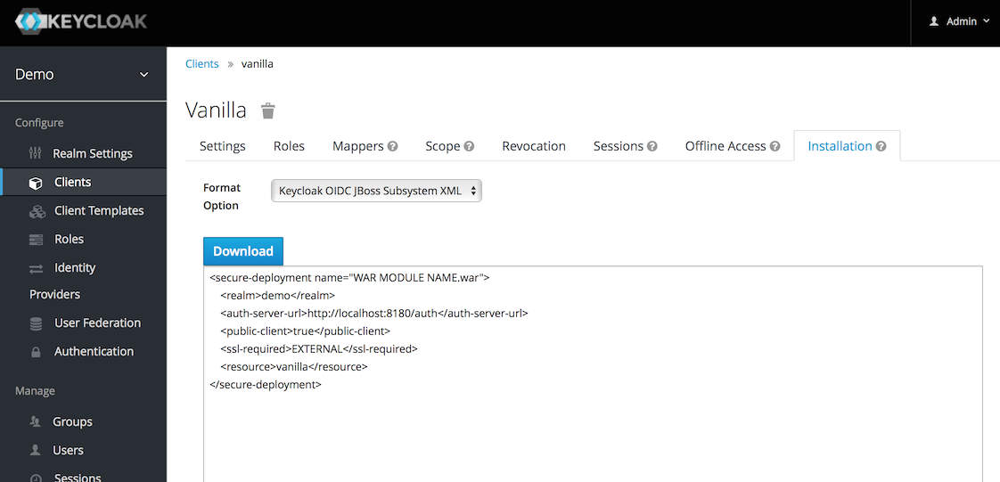

# Keycloak入门指南 {#Getting_Started_Guide}

[原文地址: https://www.keycloak.org/docs/latest/getting_started/index.html](https://www.keycloak.org/docs/latest/getting_started/index.html)


## 1. 概述 {#Overview}

本指南可帮助您开始使用Keycloak。 它涵盖了服务器配置和默认数据库的使用。 不包括高级部署选项。 有关功能或配置选项的更深入说明，请参阅其他参考指南。

## 2. 安装和启动 {#Installing_and_Booting}

本节介绍如何在独立模式下启动Keycloak服务器，设置初始管理员用户，以及登录Keycloak管理控制台。

### 2.1. 安装分发文件 {#Installing_Distribution_Files}

下载Keycloak服务器分发文件:

- **keycloak-6.0.1.[zip|tar.gz]**

> 该文件可以从 [Keycloak downloads](https://www.keycloak.org/downloads.html)下载. 

**keycloak-6.0.1.[zip|tar.gz]**文件是服务器专用的分发版。它只包含运行Keycloak服务器的脚本和二进制文件。

将文件放在您选择的目录中，并使用`unzip`或`tar`实用程序来提取它。

Linux/Unix

```
$ unzip keycloak-6.0.1.zip

or

$ tar -xvzf keycloak-6.0.1.tar.gz
```

Windows

```
> unzip keycloak-6.0.1.zip
```

### 2.2. 启动服务器 {#Booting_the_Server}

要启动Keycloak服务器，请转到服务器分发的`bin`目录并运行`standalone`启动脚本：

Linux/Unix

```
$ cd bin
$ ./standalone.sh
```

Windows

```
> ...\bin\standalone.bat
```

### 2.3. 创建管理员帐户 {#Creating_the_Admin_Account}

After the server boots, open <http://localhost:8080/auth> in your web browser. The welcome page will indicate that the server is running.

Enter a username and password to create an initial admin user.

This account will be permitted to log in to the `master` realm’s administration console, from which you will create realms and users and register applications to be secured by Keycloak.

|      | You can only create an initial admin user on the Welcome Page if you connect using `localhost`. This is a security precaution. You can create the initial admin user at the command line with the `add-user-keycloak.sh` script. For more information, see the [Server Installation and Configuration Guide](https://www.keycloak.org/docs/6.0/server_installation/) and the [Server Administration Guide](https://www.keycloak.org/docs/6.0/server_admin/). |
| ---- | ------------------------------------------------------------ |
|      |                                                              |

### 2.4. 登录管理控制台 {#Logging_in_to_the_Admin_Console}

[Edit this section](https://github.com/keycloak/keycloak-documentation/blob/master/getting_started/topics/first-boot/admin-console.adoc)[Report an issue](https://issues.jboss.org/secure/CreateIssueDetails!init.jspa?pid=12313920&components=12323375&issuetype=1&priority=3&description=File: getting_started/topics/first-boot/admin-console.adoc)

After you create the initial admin account, use the following steps to log in to the admin console:

1. Click the **Administration Console** link on the **Welcome** page or go directly to the console URL <http://localhost:8080/auth/admin/>

2. Type the username and password you created on the **Welcome** page to open the **Keycloak Admin Console**.

   Admin Console

   

## 3. 创建领域和用户 {#Creating_a_Realm_and_User}

[Edit this section](https://github.com/keycloak/keycloak-documentation/blob/master/getting_started/topics/first-realm.adoc)[Report an issue](https://issues.jboss.org/secure/CreateIssueDetails!init.jspa?pid=12313920&components=12323375&issuetype=1&priority=3&description=File: getting_started/topics/first-realm.adoc)

In this section you will create a new realm within the Keycloak admin console and add a new user to that realm. You will use that new user to log in to your new realm and visit the built-in user account service that all users have access to.

### 3.1. 在你开始之前 {#Before_You_Start}

[Edit this section](https://github.com/keycloak/keycloak-documentation/blob/master/getting_started/topics/first-realm/before.adoc)[Report an issue](https://issues.jboss.org/secure/CreateIssueDetails!init.jspa?pid=12313920&components=12323375&issuetype=1&priority=3&description=File: getting_started/topics/first-realm/before.adoc)

Before you can create your first realm, complete the installation of Keycloak and create the initial admin user as shown in [Installing and Booting](https://www.keycloak.org/docs/latest/getting_started/index.html#_install-boot).

### 3.2. 创建一个新领域 {#Creating_a_New_Realm}

[Edit this section](https://github.com/keycloak/keycloak-documentation/blob/master/getting_started/topics/first-realm/realm.adoc)[Report an issue](https://issues.jboss.org/secure/CreateIssueDetails!init.jspa?pid=12313920&components=12323375&issuetype=1&priority=3&description=File: getting_started/topics/first-realm/realm.adoc)

To create a new realm, complete the following steps:

1. Go to <http://localhost:8080/auth/admin/> and log in to the Keycloak Admin Console using the account you created in [Install and Boot](https://www.keycloak.org/docs/latest/getting_started/index.html#_install-boot).
2. From the **Master** drop-down menu, click **Add Realm**. When you are logged in to the master realm this drop-down menu lists all existing realms.
3. Type `demo` in the **Name** field and click **Create**.

When the realm is created, the main admin console page opens. Notice the current realm is now set to `demo`. Switch between managing the `master` realm and the realm you just created by clicking entries in the **Select realm** drop-down menu.

### 3.3. 创建新用户 {#Creating_a_New_User}

[Edit this section](https://github.com/keycloak/keycloak-documentation/blob/master/getting_started/topics/first-realm/user.adoc)[Report an issue](https://issues.jboss.org/secure/CreateIssueDetails!init.jspa?pid=12313920&components=12323375&issuetype=1&priority=3&description=File: getting_started/topics/first-realm/user.adoc)

To create a new user in the `demo` realm, along with a temporary password for that new user, complete the following steps:

1. From the menu, click **Users** to open the user list page.
2. On the right side of the empty user list, click **Add User** to open the add user page.
3. Enter a name in the `Username` field; this is the only required field. Click **Save** to save the data and open the management page for the new user.
4. Click the **Credentials** tab to set a temporary password for the new user.
5. Type a new password and confirm it. Click **Reset Password** to set the user password to the new one you specified.

|      | This password is temporary and the user will be required to change it after the first login. To create a password that is persistent, flip the **Temporary** switch from **On** to **Off** before clicking **Reset Password**. |
| ---- | ------------------------------------------------------------ |
|      |                                                              |

### 3.4. 用户帐户服务 {#User_Account_Service}

[Edit this section](https://github.com/keycloak/keycloak-documentation/blob/master/getting_started/topics/first-realm/account.adoc)[Report an issue](https://issues.jboss.org/secure/CreateIssueDetails!init.jspa?pid=12313920&components=12323375&issuetype=1&priority=3&description=File: getting_started/topics/first-realm/account.adoc)

1. After you create the new user, log out of the management console by opening the user drop-down menu and selecting **Sign Out**.
2. Go to <http://localhost:8080/auth/realms/demo/account> and log in to the User Account Service of your `demo` realm with the user you just created.
3. Type the username and password you created. You will be required to create a permanent password after you successfully log in, unless you changed the **Temporary** setting to **Off** when you created the password.

The user account service page will open. Every user in a realm has access to this account service by default. From this page, you can update profile information and change or add additional credentials. For more information on this service see the [Server Administration Guide](https://www.keycloak.org/docs/6.0/server_admin/).

## 4. 保护JBoss Servlet应用程序 {#Securing_a_JBoss_Servlet_Application}

[Edit this section](https://github.com/keycloak/keycloak-documentation/blob/master/getting_started/topics/secure-jboss-app.adoc)[Report an issue](https://issues.jboss.org/secure/CreateIssueDetails!init.jspa?pid=12313920&components=12323375&issuetype=1&priority=3&description=File: getting_started/topics/secure-jboss-app.adoc)

This section describes how to secure a Java servlet application on the WildFly application server by:

- Installing the Keycloak client adapter on a WildFly application server distribution
- Creating and registering a client application in the Keycloak admin console
- Configuring the application to be secured by Keycloak

### 4.1. 在你开始之前 {#Before_You_Start}

[Edit this section](https://github.com/keycloak/keycloak-documentation/blob/master/getting_started/topics/secure-jboss-app/before.adoc)[Report an issue](https://issues.jboss.org/secure/CreateIssueDetails!init.jspa?pid=12313920&components=12323375&issuetype=1&priority=3&description=File: getting_started/topics/secure-jboss-app/before.adoc)

Before you can secure a Java servlet application, you must complete the installation of Keycloak and create the initial admin user as shown in [Installing and Booting](https://www.keycloak.org/docs/latest/getting_started/index.html#_install-boot).

There is one caveat: Even though WildFly is bundled with Keycloak, you cannot use this as an application container. Instead, you must run a separate WildFly instance on the same machine as the Keycloak server to run your Java servlet application. Run the Keycloak using a different port than the WildFly, to avoid port conflicts.

To adjust the port used, change the value of the `jboss.socket.binding.port-offset` system property when starting the server from the command line. The value of this property is a number that will be added to the base value of every port opened by the Keycloak server.

To start the Keycloak server while also adjusting the port:

Linux/Unix

```
$ cd bin
$ ./standalone.sh -Djboss.socket.binding.port-offset=100
```

Windows

```
> ...\bin\standalone.bat -Djboss.socket.binding.port-offset=100
```

After starting Keycloak, go to <http://localhost:8180/auth/admin/> to access the admin console.

### 4.2. 安装客户端适配器 {#Installing_the_Client_Adapter}

[Edit this section](https://github.com/keycloak/keycloak-documentation/blob/master/getting_started/topics/secure-jboss-app/install-client-adapter.adoc)[Report an issue](https://issues.jboss.org/secure/CreateIssueDetails!init.jspa?pid=12313920&components=12323375&issuetype=1&priority=3&description=File: getting_started/topics/secure-jboss-app/install-client-adapter.adoc)

Download the WildFly distribution and extract it from the compressed file into a directory on your machine.

Download the WildFly OpenID Connect adapter distribution from [keycloak.org](https://www.keycloak.org/downloads.html).

Extract the contents of this file into the root directory of your WildFly distribution.

Run the appropriate script for your platform:

WildFly 10 and Linux/Unix

```
$ cd bin
$ ./jboss-cli.sh --file=adapter-install-offline.cli
```

WildFly 10 and Windows

```
> cd bin
> jboss-cli.bat --file=adapter-install-offline.cli
```

Wildfly 11 and Linux/Unix

```
$ cd bin
$ ./jboss-cli.sh --file=adapter-elytron-install-offline.cli
```

Wildfly 11 and Windows

```
> cd bin
> jboss-cli.bat --file=adapter-elytron-install-offline.cli
```

|      | This script will make the necessary edits to the `…/standalone/configuration/standalone.xml` file of your app server distribution and may take some time to complete. |
| ---- | ------------------------------------------------------------ |
|      |                                                              |

Start the application server.

Linux/Unix

```
$ cd bin
$ ./standalone.sh
```

Windows

```
> ...\bin\standalone.bat
```

### 4.3. 下载，构建和部署应用程序代码{#Downloading_Building_and_Deploying_Application_Code}

[Edit this section](https://github.com/keycloak/keycloak-documentation/blob/master/getting_started/topics/secure-jboss-app/download-quickstarts.adoc)[Report an issue](https://issues.jboss.org/secure/CreateIssueDetails!init.jspa?pid=12313920&components=12323375&issuetype=1&priority=3&description=File: getting_started/topics/secure-jboss-app/download-quickstarts.adoc)

You must have the following installed on your machine and available in your PATH before you continue:

- Java JDK 8
- Apache Maven 3.1.1 or higher
- Git

|      | You can obtain the code by cloning the Keycloak Quickstarts Repository repository at <https://github.com/keycloak/keycloak-quickstarts>. The quickstarts are designed to work with the most recent Keycloak release. |
| ---- | ------------------------------------------------------------ |
|      |                                                              |

Make sure your WildFly application server is started before you continue.

To download, build, and deploy the code, complete the following steps.

Clone Project

```
$ git clone https://github.com/keycloak/keycloak-quickstarts
$ cd keycloak-quickstarts/app-profile-jee-vanilla
$ mvn clean wildfly:deploy
```

During installation, you will see some text scroll by in the application server console window.

To confirm that the application is successfully deployed, go to <http://localhost:8080/vanilla> and a login page should appear.

|      | If you click **Login**, the browser will pop up a BASIC auth login dialog. However, the application is not yet secured by any identity provider, so anything you enter in the dialog box will result in a `Forbidden` message being sent back by the server. You can confirm that the application is currently secured via `BASIC`authentication by finding the setting in the application’s `web.xml` file. |
| ---- | ------------------------------------------------------------ |
|      |                                                              |

### 4.4. 创建和注册客户端 {#Creating_and_Registering_the_Client}

[Edit this section](https://github.com/keycloak/keycloak-documentation/blob/master/getting_started/topics/secure-jboss-app/create-client.adoc)[Report an issue](https://issues.jboss.org/secure/CreateIssueDetails!init.jspa?pid=12313920&components=12323375&issuetype=1&priority=3&description=File: getting_started/topics/secure-jboss-app/create-client.adoc)

To define and register the client in the Keycloak admin console, complete the following steps:

1. Log in to the admin console with your admin account.

2. In the top left drop-down menu select and manage the `Demo` realm. Click `Clients` in the left side menu to open the Clients page.

   Clients

   

3. On the right side, click **Create**.

4. Complete the fields as shown here:

   Add Client

   

5. Click **Save** to create the client application entry.

6. Click the **Installation** tab in the Keycloak admin console to obtain a configuration template.

7. Select **Keycloak OIDC JBoss Subsystem XML** to generate an XML template. Copy the contents for use in the next section.

   Template XML

   

### 4.5. 配置子系统 {#Configuring_the_Subsystem}

[Edit this section](https://github.com/keycloak/keycloak-documentation/blob/master/getting_started/topics/secure-jboss-app/subsystem.adoc)[Report an issue](https://issues.jboss.org/secure/CreateIssueDetails!init.jspa?pid=12313920&components=12323375&issuetype=1&priority=3&description=File: getting_started/topics/secure-jboss-app/subsystem.adoc)

To configure the WildFly instance that the application is deployed on so that this app is secured by Keycloak, complete the following steps.

1. Open the `standalone/configuration/standalone.xml` file in the WildFly instance that the application is deployed on and search for the following text:

   ```
   <subsystem xmlns="urn:jboss:domain:keycloak:1.1"/>
   ```

2. Modify this text to prepare the file for pasting in contents from the **Keycloak OIDC JBoss Subsystem XML** template we obtained Keycloak admin console **Installation** tab by changing the XML entry from self-closing to using a pair of opening and closing tags:

   ```
   <subsystem xmlns="urn:jboss:domain:keycloak:1.1">
   </subsystem>
   ```

3. Paste the contents of the template within the `<subsystem>` element, as shown in this example:

   ```
   <subsystem xmlns="urn:jboss:domain:keycloak:1.1">
     <secure-deployment name="WAR MODULE NAME.war">
       <realm>demo</realm>
       <auth-server-url>http://localhost:8180/auth</auth-server-url>
       <public-client>true</public-client>
       <ssl-required>EXTERNAL</ssl-required>
       <resource>vanilla</resource>
     </secure-deployment>
   </subsystem>
   ```

4. Change the `name` to `vanilla.war`:

   ```
   <subsystem xmlns="urn:jboss:domain:keycloak:1.1">
     <secure-deployment name="vanilla.war">
     ...
   </subsystem>
   ```

5. Reboot the application server.

6. Go to <http://localhost:8080/vanilla> and click **Login**. When the Keycloak login page opens, log in using the user you created in [Creating a New User](https://www.keycloak.org/docs/latest/getting_started/index.html#_create-new-user).

