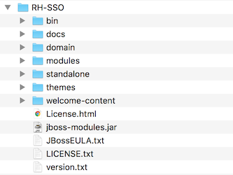
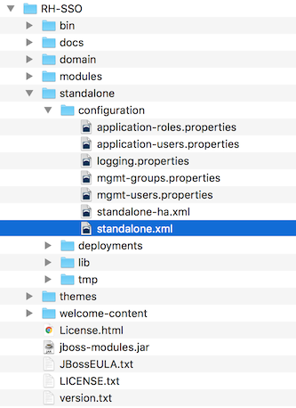
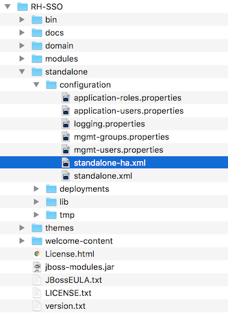
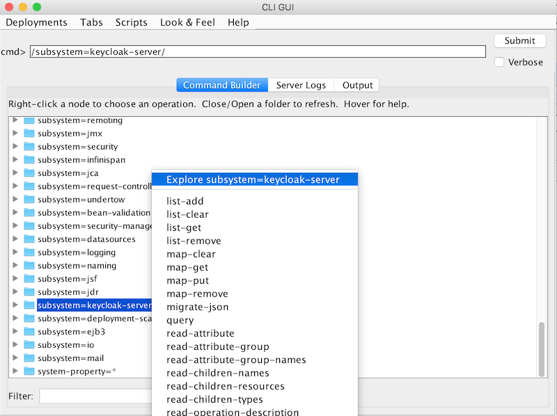

# KeyCloak服务器安装和配置指南 {#Server Installation and Configuration Guide}

[原文地址: https://www.keycloak.org/docs/latest/server_installation/index.html](https://www.keycloak.org/docs/latest/server_installation/index.html)

## 1. 指南概述 {#Guide_Overview}

本指南的目的是介绍在首次启动Keycloak服务器之前需要完成的步骤。如果您只是想测试Keycloak，它几乎是用它自己的嵌入式和本地数据库开箱即用。对于将要在生产环境中运行的实际部署，您需要决定如何在运行时管理服务器配置(独立或域模式)，为Keycloak存储配置共享数据库，设置加密和HTTPS，最后设置Keycloak在集群中运行。本指南将详细介绍部署服务器之前必须进行的任何预引导决策和设置的各个方面。

需要特别注意的一点是，Keycloak派生自WildFly应用程序服务器。配置Keycloak的许多方面都围绕着WildFly配置元素。如果您想深入了解更多细节，本指南通常会将您引向手册之外的文档。

### 1.1. 建议额外的外部文档 {#Recommended_Additional_External_Documentation}

Keycloak构建在WildFly应用服务器之上，它的子项目包括Infinispan(用于缓存)和Hibernate(用于持久性)。本指南只涵盖基础设施级配置的基础知识。强烈建议您仔细阅读WildFly及其子项目的文档。以下是文档链接:

- [*WildFly 16 Documentation*](http://docs.wildfly.org/16/Admin_Guide.html)

## 2. 安装 {#Installation}


  安装Keycloak非常简单，只需下载并解压缩即可。本章回顾了系统的需求以及发行版的目录结构。

### 2.1. 系统需求 {#System_Requirements}

以下是运行Keycloak身份验证服务器的要求:

- 能运行Java的任何操作系统
- Java 8 JDK
- zip 或者 gzip 和 tar
- 至少512M内存
- At least 1G of diskspace
- 共享的外部数据库，如PostgreSQL、MySQL、Oracle等。如果要在集群中运行，Keycloak需要一个外部共享数据库。有关更多信息，请参阅本指南的[数据库配置](https://www.keycloak.org/docs/latest/server_installation/index.html#_database)部分。
- 如果您想在集群中运行，最好计算机上的网络支持多播。Keycloak可以在没有多播的情况下集群化，但这需要大量的配置更改。有关更多信息，请参见本指南的[集群](https://www.keycloak.org/docs/latest/server_installation/index.html#_clustering)部分。
- 在Linux上，建议使用`/dev/urandom`作为随机数据的来源，以防止由于缺少可用的熵而导致密钥隐藏挂起，除非您的安全策略强制使用`/dev/random`。要在Oracle JDK 8和OpenJDK 8上实现这一点，请设置 `java.security.egd`系统属性为` file:/dev/urandom`。

### 2.2. 安装分布式文件 {#Installing_Distribution_Files}

Keycloak服务器有三个可下载的发行版:

- 'keycloak-6.0.0.[zip|tar.gz]'
- 'keycloak-overlay-6.0.0.[zip|tar.gz]'
- 'keycloak-demo-6.0.0.[zip|tar.gz]'

'keycloak-6.0.0.[zip|tar.gz]'文件是服务器唯一的发行版。它只包含运行Keycloak服务器的脚本和二进制文件。要解压缩这个文件，只需运行操作系统的`unzip`或`gunzip`和`tar`实用程序。

'keycloak-overlay-6.0.0.[zip|tar.gz]'文件是一个WildFly插件，允许您在现有的WildFly发行版上安装Keycloak服务器。我们不支持用户希望在同一服务器实例上运行应用程序和Keycloak。要安装Keycloak服务包，只需将其解压到WildFly发行版的根目录中，打开shell中的bin目录并运行`./jboss-cli.[sh|bat] --file=keycloak-install.cli`。

'keycloak-demo-6.0.0.[zip|tar.gz]' 包含服务器二进制文件、所有文档和所有示例。它预先配置了OIDC和SAML客户机应用程序适配器，可以在不进行任何配置的情况下开箱即用地部署任何分发示例。此分发版只建议那些想要测试Keycloak的用户使用。我们不支持用户在生产环境中运行演示发行版。

要解压缩这些文件，请运行`unzip`或`gunzip`和`tar`实用程序。

### 2.3. 分布式目录结构 {#Distribution_Directory_Structure}

本章将介绍服务器分发版的目录结构。

分布式目录结构



让我们来看看其中一些目录的用途:

- *bin/*

  它包含各种脚本，可以启动服务器，也可以在服务器上执行其他管理操作。

- *domain/*

  当在[域模式](https://www.keycloak.org/docs/latest/server_installation/index.html#_domain-mode)中运行Keycloak时，它包含配置文件和工作目录。

- *modules/*

  这些都是服务器使用的所有Java库。

- *providers/*

  如果您正在为keycloak编写扩展，可以将扩展放在这里。有关这方面的更多信息，请参见[服务器开发人员指南](https://www.keycloak.org/docs/6.0/server_development/)。

- *standalone/*

  这包含配置文件和工作目录时，运行Keycloak在[独立模式](https://www.keycloak.org/docs/latest/server_installation/index.html#_standalone-mode)。

- *themes/*

  此目录包含用于服务器显示的任何UI所需要的所有html、样式表、JavaScript文件和图像。在这里，您可以修改现有的主题或创建自己的主题。有关这方面的更多信息，请参见[服务器开发人员指南](https://www.keycloak.org/docs/6.0/server_development/)。

## 3. 选择工作模式 {#Choosing_an_Operating_Mode}

在生产环境中部署Keycloak之前，您需要决定使用哪种类型的操作模式。您会在集群中运行Keycloak吗?您需要一种集中的方式来管理服务器配置吗?您选择的操作模式将影响您如何配置数据库、配置缓存，甚至如何启动服务器。

> Keycloak构建在WildFly应用服务器之上。本指南只讨论在特定模式下部署的基础知识。如果您想了解这方面的具体信息，最好的去处是[*WildFly 16 Documentation*](http://docs.wildfly.org/16/Admin_Guide.html).  

### 3.1. 独立模式 {#Standalone_Mode}

独立的操作模式只在您希望运行一个且仅运行一个Keycloak服务器实例时才有用。它不适用于集群部署，而且所有缓存都是非分布式的，并且只在本地使用。 不建议在生产中使用独立模式，因为只有一个故障点。如果您的单机模式服务器宕机，用户将无法登录。这种模式只适用于测试驱动和使用Keycloak的功能.

#### 3.1.1. 独立的启动脚本 {#Standalone_Boot_Script}

当以独立模式运行服务器时，您需要运行一个特定的脚本来启动服务器，这取决于您的操作系统。这些脚本位于服务器分发版的 *bin/* 目录中。

独立的启动脚本


启动服务器:

Linux/Unix

```bash
$ .../bin/standalone.sh
```

Windows

```bash
> ...\bin\standalone.bat
```

#### 3.1.2. 独立的配置 {#Standalone_Configuration}

本指南的大部分内容将指导您如何配置Keycloak的基础设施级别方面。 这些方面是在配置文件中配置的，该配置文件特定于Keycloak派生的应用程序服务器。在独立操作模式下，该文件位于 *.. / independent /configuration/standalone.xml* 中。 此文件还用于配置特定于Keycloak组件的非基础设施级别的内容。

独立的配置文件



> 在服务器运行时对该文件所做的任何更改都不会生效，甚至可能被服务器覆盖。而是使用命令行脚本或WildFly的web控制台。 更多信息参见[*WildFly 16 Documentation*](http://docs.wildfly.org/16/Admin_Guide.html)。                     

### 3.2. 独立的集群模式 {#Standalone_Clustered_Mode}

当您希望在集群中运行Keycloak时，可以使用独立集群操作模式。此模式要求在希望运行服务器实例的每台计算机上都有Keycloak分发版的副本。这种模式最初很容易部署，但是会变得相当麻烦。要进行配置更改，您必须修改每台机器上的每个发行版。对于大型集群，这可能会耗费时间并容易出错。

#### 3.2.1. 独立的集群配置 {#Standalone_Clustered_Configuration}

该发行版有一个主要预配置的app服务器配置文件，用于在集群中运行。它具有用于网络、数据库、缓存和发现的所有特定基础设施设置。此文件驻留在 *…/standalone/configuration/standalone-ha.xml*. 这个配置中缺少一些东西。如果不配置共享数据库连接，就不能在集群中运行Keycloak。您还需要在集群前面部署某种类型的负载均衡器。 本指南的[集群](https://www.keycloak.org/docs/latest/server_installation/index.html#_clustering)  和 [数据库](https://www.keycloak.org/docs/latest/server_installation/index.html#_database) 部分将指导您了解这些内容。

标准HA配置



> 在服务器运行时对该文件所做的任何更改都不会生效，甚至可能被服务器覆盖。建议使用命令行脚本或WildFly的web控制台。 更多信息参见 [*WildFly 16 Documentation*](http://docs.wildfly.org/16/Admin_Guide.html)                                  |

#### 3.2.2. 独立集群启动脚本 {#Standalone_Clustered_Boot_Script}

使用与在独立模式下相同的引导脚本启动Keycloak。不同之处在于，您传递了一个额外的标志来指向HA配置文件。

独立集群启动脚本


启动服务器:

Linux/Unix

```bash
$ .../bin/standalone.sh --server-config=standalone-ha.xml
```

Windows

```bash
> ...\bin\standalone.bat --server-config=standalone-ha.xml
```

### 3.3. 域集群模式 {#Domain_Clustered_Mode}

域模式是一种集中管理和发布服务器配置的方法。

在标准模式下运行集群会随着集群规模的增长而迅速恶化。每次需要更改配置时，都必须在集群中的每个节点上执行。 域模式解决了这个问题通过提供一个中心位置存储和发布配置。 设置起来可能相当复杂，但最终是值得的。这个功能被内置到WildFly应用服务器中，Keycloak就是从这个应用服务器派生的。

> 本指南将介绍域模式的基本知识。关于如何在集群中设置域模式的详细步骤应该从[*WildFly 16 Documentation*](http://docs.wildfly.org/16/Admin_Guide.html). 获得。

以下是在域模式下运行的一些基本概念。

- 域控制器

  域控制器是一个进程，负责存储、管理和发布集群中每个节点的一般配置。这个进程是集群中的节点获取其配置的中心点。

- 主机控制器

  主机控制器负责管理特定机器上的服务器实例。 您将其配置为运行一个或多个服务器实例。域控制器还可以与每台机器上的主机控制器交互来管理集群。 为了减少运行进程的数量，域控制器还充当它所运行机器上的主机控制器。

- 域配置文件

  域配置文件是一组命名的配置文件，可供服务器用于引导。 域控制器可以定义不同服务器使用的多个域配置文件。

- 服务器组

  服务器组是服务器的集合。它们被管理并配置为一个。您可以将一个域配置文件分配给一个服务器组，该组中的每个服务都将使用该域配置文件作为它们的配置。

在域模式下，在主节点上启动域控制器。集群的配置位于域控制器中。 接下来，在群集中的每台计算机上启动主机控制器。 每个主机控制器部署配置指定将在该计算机上启动的Keycloak服务器实例数。 当主机控制器启动时，它启动的Keycloak服务器实例与配置时一样多。这些服务器实例从域控制器中提取配置。

#### 3.3.1. 域配置 {#Domain_Configuration}

本指南的其他各章将介绍如何配置数据库、HTTP网络连接、缓存和其他与基础设施相关的内容。 虽然独立模式使用 *standalone.xml* 文件来配置这些内容，但域模式使用 *.../domain/configuration/domain.xml* 配置文件。 这里定义了Keycloak 服务器的域配置文件和服务器组。

domain.xml


> 在域控制器运行时对该文件所做的任何更改都不会生效，甚至可能被服务器覆盖。建议使用命令行脚本或WildFly的web控制台。 更多信息参见[*WildFly 16 Documentation*](http://docs.wildfly.org/16/Admin_Guide.html)

我们来看看这个 *domain.xml* 文件的某些内容。 `auth-server-standalone` 和 `auth-server-clustered` `profile` XML块是您进行大量配置决策的地方。 您将在此处配置网络连接，缓存和数据库连接等内容。

auth-server配置

```xml
    <profiles>
        <profile name="auth-server-standalone">
            ...
        </profile>
        <profile name="auth-server-clustered">
            ...
        </profile>
```

`auth-server-standalone`配置是非集群设置。 `auth-server-clustered`配置是集群设置。

如果你进一步向下滚动，你会看到定义了各种`socket-binding-groups`。

socket-binding-groups

```xml
    <socket-binding-groups>
        <socket-binding-group name="standard-sockets" default-interface="public">
           ...
        </socket-binding-group>
        <socket-binding-group name="ha-sockets" default-interface="public">
           ...
        </socket-binding-group>
        <!-- load-balancer-sockets should be removed in production systems and replaced with a better software or hardware based one -->
        <socket-binding-group name="load-balancer-sockets" default-interface="public">
           ...
        </socket-binding-group>
    </socket-binding-groups>
```

此配置定义使用每个Keycloak服务器实例打开的各种连接器的默认端口映射。 包含`$ {...}`的任何值都是可以在命令行上使用`-D`开关重写的值，例如:

```bash
$ domain.sh -Djboss.http.port=80
```

Keycloak服务器组的定义位于 `server-groups` XML块中。 它指定在主机控制器启动实例时使用的域配置文件(`default`)以及Java VM的一些默认引导参数。 它还将`socket-binding-group`绑定到服务器组。

server group

```xml
    <server-groups>
        <!-- load-balancer-group should be removed in production systems and replaced with a better software or hardware based one -->
        <server-group name="load-balancer-group" profile="load-balancer">
            <jvm name="default">
                <heap size="64m" max-size="512m"/>
            </jvm>
            <socket-binding-group ref="load-balancer-sockets"/>
        </server-group>
        <server-group name="auth-server-group" profile="auth-server-clustered">
            <jvm name="default">
                <heap size="64m" max-size="512m"/>
            </jvm>
            <socket-binding-group ref="ha-sockets"/>
        </server-group>
    </server-groups>
```

#### 3.3.2. 主机控制器配置 {#Host_Controller_Configuration}

Keycloak附带了两个主机控制器配置文件，它们位于 *.../domain/configuration/* 目录中：*host-master.xml* 和 *host-slave.xml*。 *host-master.xml* 配置为启动域控制器，负载均衡器和一个Keycloak服务器实例。 *host-slave.xml* 配置为与域控制器通信并启动一个Keycloak服务器实例。

> 负载均衡器不是必需的服务。 它的存在使您可以轻松地在开发计算机上测试驱动器群集。 虽然可以在生产中使用，但如果您要使用其他基于硬件或软件的负载均衡器，则可以选择替换它。

主机控制器配置


要禁用负载均衡器服务器实例，请编辑 *host-master.xml* 并注释掉或删除 `"load-balancer"` 条目。

```xml
    <servers>
        <!-- remove or comment out next line -->
        <server name="load-balancer" group="loadbalancer-group"/>
        ...
    </servers>
```

关于此文件的另一个有趣的事情是声明身份验证服务器实例。 它有一个`port-offset`设置。 *domain.xml*`socket-binding-group`或服务器组中定义的任何网络端口都将添加`port-offset`的值。 对于此示例域设置，我们执行此操作，以便负载平衡器服务器打开的端口不会与启动的身份验证服务器实例冲突。

```xml
    <servers>
        ...
        <server name="server-one" group="auth-server-group" auto-start="true">
             <socket-bindings port-offset="150"/>
        </server>
    </servers>
```

#### 3.3.3. 服务器实例工作目录 {#Server_Instance_Working_Directories}

主机文件中定义的每个Keycloak服务器实例在 *…/domain/servers/{SERVER NAME}* 下创建一个工作目录。可以在其中进行其他配置，并且服务器实例需要或创建的任何临时，日志或数据文件也可以放在那里。 每个服务器目录的结构最终看起来像任何其他WildFly启动的服务器。

工作目录


#### 3.3.4. 域启动脚本 {#Domain_Boot_Script}

在域模式下运行服务器时，根据您的操作系统，需要运行特定的脚本来启动服务器。 这些脚本位于服务器分发的 *bin/* 目录中。

域启动脚本


启动服务器:

Linux/Unix

```bash
$ .../bin/domain.sh --host-config=host-master.xml
```

Windows

```bash
> ...\bin\domain.bat --host-config=host-master.xml
```

运行启动脚本时，您需要通过`--host-config`开关传入您将要使用的主机控制配置文件。

#### 3.3.5. 集群域示例 {#Clustered_Domain_Example}

您可以使用开箱即用的 *domain.xml* 配置测试驱动器集群。这个示例域是用来在一台机器上运行并启动的:

- 1个域控制器
- 1个HTTP负载均衡器
- 2个Keycloak服务器实例

要模拟在两台计算机上运行集群，您将运行`domain.sh`脚本两次以启动两个单独的主机控制器。 第一个是主控主机控制器，它将启动域控制器，HTTP负载平衡器和一个Keycloak认证服务器实例。 第二个是从属主机控制器，它只启动一个认证服务器实例。

##### 设置从属控制器到域控制器的连接

在启动之前，您必须配置从属主机控制器，以便它可以安全地与域控制器通信。如果不这样做，则从属主机将无法从域控制器获取集中式配置。 要设置安全连接，您必须创建服务器管理员用户和将在主服务器和从服务器之间共享的密钥。 您可以通过运行 `…/bin/add-user.sh` 脚本来完成此操作。

当您运行脚本时，选择 `Management User` 并回答 `yes` ，当它询问您是否将新用户用于一个AS进程以连接到另一个AS进程时。 这将生成一个秘密值，您需要将其剪切并粘贴到 *…/domain/configuration/host-slave.xml* 文件中。

添加: App Server Admin

```bash
$ add-user.sh
 What type of user do you wish to add?
  a) Management User (mgmt-users.properties)
  b) Application User (application-users.properties)
 (a): a
 Enter the details of the new user to add.
 Using realm 'ManagementRealm' as discovered from the existing property files.
 Username : admin
 Password recommendations are listed below. To modify these restrictions edit the add-user.properties configuration file.
  - The password should not be one of the following restricted values {root, admin, administrator}
  - The password should contain at least 8 characters, 1 alphabetic character(s), 1 digit(s), 1 non-alphanumeric symbol(s)
  - The password should be different from the username
 Password :
 Re-enter Password :
 What groups do you want this user to belong to? (Please enter a comma separated list, or leave blank for none)[ ]:
 About to add user 'admin' for realm 'ManagementRealm'
 Is this correct yes/no? yes
 Added user 'admin' to file '/.../standalone/configuration/mgmt-users.properties'
 Added user 'admin' to file '/.../domain/configuration/mgmt-users.properties'
 Added user 'admin' with groups to file '/.../standalone/configuration/mgmt-groups.properties'
 Added user 'admin' with groups to file '/.../domain/configuration/mgmt-groups.properties'
 Is this new user going to be used for one AS process to connect to another AS process?
 e.g. for a slave host controller connecting to the master or for a Remoting connection for server to server EJB calls.
 yes/no? yes
 To represent the user add the following to the server-identities definition <secret value="bWdtdDEyMyE=" />
```

> add-user.sh不会将用户添加到Keycloak服务器，而是添加到基础JBoss企业应用程序平台。 上述脚本中使用和生成的凭据仅用于示例目的。 请使用系统上生成的。   

现在将秘密值剪切并粘贴到 *…/domain/configuration/host-slave.xml* 文件中，如下所示：

```xml
     <management>
         <security-realms>
             <security-realm name="ManagementRealm">
                 <server-identities>
                     <secret value="bWdtdDEyMyE="/>
                 </server-identities>
```

您还需要在 *…/domain/configuration/host-slave.xml* 文件中添加已创建用户的 *username*：

```xml
     <remote security-realm="ManagementRealm" username="admin">
```

##### 运行启动脚本

由于我们在一台开发机器上模拟双节点集群，因此您将运行两次启动脚本：

启动 主

```bash
$ domain.sh --host-config=host-master.xml
```

启动 从属

```bash
$ domain.sh --host-config=host-slave.xml
```

要试用它，请打开浏览器并转到 <http://localhost:8080/auth>。

### 3.4. 跨数据中心复制模式 {#Cross-Datacenter_Replication_Mode}

跨数据中心复制模式适用于您希望跨多个数据中心在集群中运行Keycloak，最常用的是使用位于不同地理区域的数据中心站点。 使用此模式时，每个数据中心都有自己的Keycloak服务器集群。

本文档将引用以下示例体系结构图来说明和描述简单的跨数据中心复制用例。

示例架构图


#### 3.4.1. 先决条件 {#Prerequisites}

由于这是一个高级主题，我们建议您首先阅读以下内容，它们提供了宝贵的背景知识：

- [集群与Keycloak](https://www.keycloak.org/docs/6.0/server_installation/#_clustering) 设置跨数据中心复制时，您将使用更多独立的Keycloak集群，因此您必须了解集群的工作方式以及基本概念和要求，例如负载平衡，共享数据库和多播。
- [JBoss数据网格跨数据中心复制](https://access.redhat.com/documentation/en-us/red_hat_data_grid/7.3/html/red_hat_data_grid_user_guide/x_site_replication) Keycloak使用JBoss Data Grid（JDG）在数据中心之间复制Infinispan数据。

#### 3.4.2. 技术细节 {#Technical_details}

本节介绍了如何完成Keycloak跨数据中心复制的概念和详细信息。

Data(数据)

Keycloak是有状态的应用程序。 它使用以下作为数据源：

- 数据库用于保存永久数据，例如用户信息。
- Infinispan缓存用于缓存来自数据库的持久性数据，还用于保存一些短期和频繁更改的元数据，例如用于用户会话。 Infinispan通常比数据库快得多，但是使用Infinispan保存的数据不是永久性的，并且预计不会在集群重启期间持续存在。

在我们的示例架构中，有两个名为 `site1` 和 `site2` 的数据中心。 对于跨数据中心复制，我们必须确保两个数据源都可靠地工作，并且来自 `site1` 的Keycloak服务器最终能够读取`site2`上的Keycloak服务器保存的数据。

根据环境，您可以选择是否愿意：

- 可靠性 - 通常用于 `主/主` 模式。 写在`site1`上的数据必须立即在`site2`上可见。
- 性能 - 通常用于 `主/被`模式。 写在`site1`上的数据不需要立即在`site2`上可见。 在某些情况下，数据可能在`site2`上根本不可见。

For more details, see [Modes](https://www.keycloak.org/docs/latest/server_installation/index.html#modes).

#### 3.4.3. 请求处理 {#Request_processing}

最终用户的浏览器向[前端负载均衡器](https://www.keycloak.org/docs/6.0/server_installation/#_setting-up-a-load-balancer-or-proxy)发送HTTP请求。 此负载均衡器通常是HTTPD或WildFly，带有mod_cluster，NGINX，HA代理，或者某些其他类型的软件或硬件负载均衡器。

然后，负载均衡器将其接收的HTTP请求转发到基础Keycloak实例，这些实例可以在多个数据中心之间传播。 负载平衡器通常为[粘性会话](https://www.keycloak.org/docs/6.0/server_installation/#sticky-sessions)提供支持, 这意味着负载均衡器能够始终将来自同一用户的所有HTTP请求转发到同一数据中心内的同一Keycloak实例。

从客户端应用程序发送到负载均衡器的HTTP请求称为“反向通道请求”。终端用户的浏览器不会看到这些，因此不能作为用户和负载平衡器之间的粘性会话的一部分。 对于反向信道请求，负载均衡器可以将HTTP请求转发到任何数据中心中的任何Keycloak实例。 这很有挑战性，因为一些OpenID Connect和一些SAML流需要来自用户和应用程序的多个HTTP请求。 由于我们不能可靠地依赖粘性会话来强制将所有相关请求发送到同一数据中心中的同一个Keycloak实例，因此我们必须跨数据中心复制一些数据，以便在特定流期间由后续HTTP请求查看数据。

#### 3.4.4. 模式 {#Modes}

根据您的要求，跨数据中心复制有两种基本操作模式：

- 主/备 - 这里，用户和客户端应用程序仅将请求发送到单个数据中心的Keycloak节点。 第二个数据中心仅用作保存数据的`备份`。 如果主数据中心出现故障，通常可以从第二个数据中心恢复数据。
- 主/主 - 这里，用户和客户端应用程序将请求发送到两个数据中心的Keycloak节点。 这意味着数据需要立即在两个站点上可见，并且可以立即从两个站点上的Keycloak服务器中使用。 如果Keycloak服务器在`site1`上写入一些数据，并且要求在`site1`上的写入完成后，立即可以通过`site2`上的Keycloak服务器读取数据。

`主动/被动`模式对性能更好。 有关如何为任一模式配置高速缓存的详细信息，请参阅：[SYNC或ASYNC备份](https://www.keycloak.org/docs/latest/server_installation/index.html#backups).

#### 3.4.5. 数据库 {#Database}

Keycloak使用关系数据库管理系统(RDBMS)来持久保存有关领域，客户端，用户等的一些元数据。 有关详细信息，请参阅服务器安装指南的[本章](https://www.keycloak.org/docs/6.0/server_installation/#_database)。 在跨数据中心复制设置中，我们假设两个数据中心都与同一个数据库通信，或者每个数据中心都有自己的数据库节点，并且两个数据库节点在数据中心之间同步复制。 在这两种情况下，当`site1`上的Keycloak服务器持久保存某些数据并提交事务时，要求这些数据立即在`site2`上的后续数据库事务中可见。

数据库设置的细节超出了Keycloak的范围，但是像MariaDB和Oracle这样的许多RDBMS供应商都提供了复制数据库和同步复制。 我们与这些供应商一起测试Keycloak：

- Oracle Database 12c Release 1 (12.1) RAC
- Galera 3.12 cluster for MariaDB server version 10.1.19-MariaDB

#### 3.4.6. Infinispan缓存 {#Infinispan_caches}

本节首先介绍Infinispan缓存的高级描述。 下面是缓存设置的更多细节。

Authentication sessions (认证会话)

在Keycloak中，我们有认证会话的概念。 有一个名为 `authenticationSessions` 的独立Infinispan缓存用于在特定用户的身份验证期间保存数据。 来自此缓存的请求通常只涉及浏览器和Keycloak服务器，而不是应用程序。 在这里，我们可以依赖粘性会话，即使您处于`主/主` 模式，也不需要跨数据中心复制 `authenticationSessions` 缓存内容。

Action tokens (动作令牌)

我们还有[动作令牌](https://www.keycloak.org/docs/6.0/server_development/#_action_token_spi)的概念， 通常用于用户需要通过电子邮件异步地确认操作的场景。例如，在“忘记密码”流期间，`actiontoken`Infinispan缓存用于跟踪有关操作令牌的元数据，比如已经使用了哪个操作令牌，因此不能第二次重用。这通常需要跨数据中心复制。

持久数据的缓存和失效

Keycloak使用Infinispan来缓存持久数据，以避免对数据库的许多不必要的请求。 缓存提高了性能，但它增加了额外的挑战。 当某些Keycloak服务器更新任何数据时，所有数据中心中的所有其他Keycloak服务器都需要知道它，因此它们会使其缓存中的特定数据无效。 Keycloak使用称为`realms` ，`users` 和 `authorization` 的本地Infinispan缓存来缓存持久数据。

我们使用单独的缓存 `work`，它在所有数据中心中复制。 工作缓存本身不会缓存任何实际数据。 它仅用于在群集节点和数据中心之间发送失效消息。 换句话说，当更新数据时，例如用户`john`，Keycloak节点将失效消息发送到同一数据中心的所有其他集群节点以及所有其他数据中心。 收到无效通知后，每个节点都会从其本地缓存中使相应的数据无效。

User sessions (用户会话)

Infinispan缓存称为 `sessions`, `clientSessions`, `offlineSessions` 和 `offlineClientSessions`，所有这些缓存通常都需要跨数据中心进行复制。 这些缓存用于保存有关用户会话的数据，这些数据对用户的浏览器会话长度有效。 缓存必须处理来自最终用户和应用程序的HTTP请求。 如上所述，在此实例中无法可靠地使用粘性会话，但我们仍希望确保后续HTTP请求可以查看最新数据。 因此，数据通常在数据中心之间复制。

Brute force protection (强力保护)

最后，`loginFailures` 缓存用于跟踪有关失败登录的数据，例如用户`john` 输入错误密码的次数。 详细说明[此处](https://www.keycloak.org/docs/6.0/server_admin/#password-guess-brute-force-attacks)。 管理员是否应该跨数据中心复制此缓存。 要准确计算登录失败次数，需要进行复制。 另一方面，不复制此数据可以节省一些性能。 因此，如果性能比准确的登录失败计数更重要，则可以避免复制。

有关如何配置高速缓存的更多详细信息，请参阅[调整JDG高速缓存配置](https://www.keycloak.org/docs/latest/server_installation/index.html#tuningcache)。

#### 3.4.7. 通信细节 {#Communication_details}

keycover使用多个独立的Infinispan缓存集群。每个Keycloak 节点都与相同数据中心中的其他Keycloak 节点在集群中，但不包含不同数据中心的Keycloak节点。 Keycloak节点不直接与来自不同数据中心的Keycloak节点通信。 Keycloak节点使用外部JDG（实际上是Infinispan服务器）跨数据中心进行通信。 这是使用[Infinispan HotRod协议](http://infinispan.org/docs/8.2.x/user_guide/user_guide.html#using_hot_rod_server)。

Keycloak端上的Infinispan缓存必须配置为[remoteStore](http://infinispan.org/docs/8.2.x/user_guide/user_guide.html#remote_store)，以确保数据被保存到远程缓存中。JDG服务器之间有单独的Infinispan集群，因此保存在 `site1` 上的JDG1上的数据被复制到 `site2`上的JDG2上。

最后，接收JDG服务器通过客户机侦听器通知集群中的Keycloak服务器，这是HotRod协议的一个特性。然后更新它们的Infinispan缓存，特定的用户会话也可以在 `site2` 的Keycloak节点上看到。

有关更多细节，请参见[示例架构图](https://www.keycloak.org/docs/latest/server_installation/index.html#archdiagram)。

#### 3.4.8. 基本设置 {#Basic_setup}

在本例中，我们描述了使用两个数据中心，`site1` 和 `site2`。 每个数据中心由1个Infinispan服务器和2个Keycloak服务器组成。 我们最终将拥有2台Infinispan服务器和4台Keycloak服务器。

- `Site1` 由Infinispan服务器，`jdg1` 和2个Keycloak服务器，`node11` 和 `node12` 组成。
- `Site2` 由Infinispan服务器，`jdg2` 和2个Keycloak服务器，`node21` 和 `node22` 组成。
- Infinispan服务器 `jdg1` 和 `jdg2` 通过 RELAY2 协议和 `backup` 的Infinispan缓存相互连接，其方式与[JDG文档](https://access.redhat.com/documentation/en-us/red_hat_data_grid/7.3/html/red_hat_data_grid_user_guide/x_site_replication)中描述的类似。
- Keycloak服务器 `node11` 和 `node12` 彼此形成一个集群，但它们不直接与 `site2` 中的任何服务器通信。 它们使用HotRod协议（远程缓存）与Infinispan服务器 `jdg1` 进行通信。 有关详细信息，请参阅[通信详细信息](https://www.keycloak.org/docs/latest/server_installation/index.html#communication)。
- 同样的细节适用于 `node21` 和 `node22`。它们彼此集群，仅使用HotRod协议与`jdg2`服务器通信。

我们的示例设置假定所有4个Keycloak服务器都与同一个数据库通信。 在生产中，建议在数据库中使用单独的同步复制数据库，如[数据库](https://www.keycloak.org/docs/latest/server_installation/index.html#database)中所述。

##### Infinispan服务器设置

请按照以下步骤设置Infinispan服务器：

1. 下载Infinispan 9.4.8服务器并解压缩到您选择的目录。 该位置将在后面的步骤中称为 `JDG1_HOME` 。

2. 在JGroups子系统的配置中更改 `JDG1_HOME/standalone/configuration/clustered.xml`中的那些内容：

   1. 在 `channels` 元素下添加 `xsite` 通道，它将使用`tcp` 堆栈：

      ```xml
      <channels default="cluster">
          <channel name="cluster"/>
          <channel name="xsite" stack="tcp"/>
      </channels>
      ```

   2. 在 `udp` 堆栈的末尾添加 `relay` 元素。 我们将以我们的站点为 `site1` 的方式配置它，而我们将备份的另一个站点是 `site2` ：

      ```xml
      <stack name="udp">
          ...
          <relay site="site1">
              <remote-site name="site2" channel="xsite"/>
              <property name="relay_multicasts">false</property>
          </relay>
      </stack>
      ```

   3. 配置`tcp`堆栈使用`TCPPING`协议而不是'MPING`。 删除`MPING`元素并将其替换为`TCPPING`。 `initial_hosts`元素指向主机`jdg1`和`jdg2`：

      ```xml
      <stack name="tcp">
          <transport type="TCP" socket-binding="jgroups-tcp"/>
          <protocol type="TCPPING">
              <property name="initial_hosts">jdg1[7600],jdg2[7600]</property>
              <property name="ergonomics">false</property>
          </protocol>
          <protocol type="MERGE3"/>
          ...
      </stack>
      ```

      > 这只是一个让程序快速运行的示例设置。在生产中，JGroups ' RELAY2 '不需要使用' tcp '栈， 但是您可以配置任何其他堆栈。例如，如果数据中心之间的网络支持多播，可以使用默认的udp堆栈。 只要确保Infinispan和Keycloak集群是相互不可发现的。 同样，您不需要使用 `TCPPING` 作为发现协议。 在生产中，你可能不会使用`TCPPING`因为它是静态的。 最后，站点名称也是可配置的。 这个更详细的设置的详细信息超出了Keycloak文档的范围。 有关更多详细信息，请参阅Infinispan文档和JGroups文档。

3. 将其添加到名为`clustered`的缓存容器下的`JDG1_HOME/standalone/configuration/clustered.xml`中：

   ```xml
   <cache-container name="clustered" default-cache="default" statistics="true">
           ...
           <replicated-cache-configuration name="sessions-cfg" mode="SYNC" start="EAGER" batching="false">
               <locking acquire-timeout="0" />
               <backups>
                   <backup site="site2" failure-policy="FAIL" strategy="SYNC" enabled="true">
                       <take-offline min-wait="60000" after-failures="3" />
                   </backup>
               </backups>
           </replicated-cache-configuration>
   
           <replicated-cache name="work" configuration="sessions-cfg"/>
           <replicated-cache name="sessions" configuration="sessions-cfg"/>
           <replicated-cache name="clientSessions" configuration="sessions-cfg"/>
           <replicated-cache name="offlineSessions" configuration="sessions-cfg"/>
           <replicated-cache name="offlineClientSessions" configuration="sessions-cfg"/>
           <replicated-cache name="actionTokens" configuration="sessions-cfg"/>
           <replicated-cache name="loginFailures" configuration="sessions-cfg"/>
   
   </cache-container>
   ```

   > 有关 `replicated-cache-configuration` 中的配置选项的详细信息，请参阅[调整JDG缓存配置](https://www.keycloak.org/docs/latest/server_installation/index.html#tuningcache)，其中包含信息 关于调整其中一些选项。

   > 与以前的版本不同，Infinispan服务器 `replicated-cache-configuration` 需要在没有 `transaction` 元素的情况下进行配置。 有关详细信息，请参阅[故障排除](https://www.keycloak.org/docs/latest/server_installation/index.html#troubleshooting) 。

4. 在通过网络访问受保护的缓存之前，某些Infinispan服务器版本需要授权。

   > 如果您使用推荐的Infinispan 9.4.8服务器，则不应该看到任何问题，并且可以（并且应该）忽略此步骤。 与授权相关的问题可能仅适用于Infinispan服务器的某些其他版本。

   Keycloak需要更新包含脚本的 `___ script_cache` 缓存。 如果访问此缓存时出错，则需要在 `clustered.xml` 配置中设置授权，如下所述：

   1. 在 `<management>` 部分中，添加一个安全领域：

      ```xml
      <management>
          <security-realms>
              ...
              <security-realm name="AllowScriptManager">
                  <authentication>
                      <users>
                          <user username="___script_manager">
                              <password>not-so-secret-password</password>
                          </user>
                      </users>
                  </authentication>
              </security-realm>
          </security-realms>
      ```

   2. 在服务器核心子系统中，添加 `<security>` ，如下所示：

      ```xml
      <subsystem xmlns="urn:infinispan:server:core:8.4">
          <cache-container name="clustered" default-cache="default" statistics="true">
              <security>
                  <authorization>
                      <identity-role-mapper/>
                      <role name="___script_manager" permissions="ALL"/>
                  </authorization>
              </security>
              ...
      ```

   3. 在端点子系统中，将身份验证配置添加到Hot Rod连接器：

      ```xml
      <subsystem xmlns="urn:infinispan:server:endpoint:8.1">
          <hotrod-connector cache-container="clustered" socket-binding="hotrod">
              ...
              <authentication security-realm="AllowScriptManager">
                  <sasl mechanisms="DIGEST-MD5" qop="auth" server-name="keycloak-jdg-server">
                      <policy>
                          <no-anonymous value="false" />
                      </policy>
                  </sasl>
              </authentication>
      ```

5. 将服务器复制到第二个位置，稍后将称之为 `JDG2_HOME`。

6. 在 `JDG2_HOME/standalone/configuration/clustered.xml`交换`site1`和`site2`，反之亦然，在JGroups子系统中的 `relay` 配置和cache-subsystem中 `backups` 的配置。 例如：

   1. `relay`元素应如下所示：

      ```xml
      <relay site="site2">
          <remote-site name="site1" channel="xsite"/>
          <property name="relay_multicasts">false</property>
      </relay>
      ```

   2. 像这样的`backups`元素：

      ```xml
                  <backups>
                      <backup site="site1" ....
                      ...
      ```

      由于Infinispan子系统不支持用表达式替换站点名，因此目前需要为两个站点上的JDG服务器提供不同的配置文件。有关详细信息，请参见[this issue](https://issues.jboss.org/browse/WFLY-9458)。

7. 启动服务器 `jdg1`:

   ```bash
   cd JDG1_HOME/bin
   ./standalone.sh -c clustered.xml -Djava.net.preferIPv4Stack=true \
     -Djboss.default.multicast.address=234.56.78.99 \
     -Djboss.node.name=jdg1 -b PUBLIC_IP_ADDRESS
   ```

8. 启动服务器`jdg2`。由于存在不同的组播地址，因此`jdg1`和`jdg2`服务器并不直接集群在一起;相反，它们只是通过RELAY2协议连接，TCP JGroups堆栈用于它们之间的通信。启动命令是这样的:

   ```bash
   cd JDG2_HOME/bin
   ./standalone.sh -c clustered.xml -Djava.net.preferIPv4Stack=true \
     -Djboss.default.multicast.address=234.56.78.100 \
     -Djboss.node.name=jdg2 -b PUBLIC_IP_ADDRESS
   ```

9. 要验证此时通道是否工作，您可能需要使用JConsole并连接到正在运行的`JDG1`或`JDG2`服务器。当您使用MBean `jgroups:type=protocol,cluster="cluster",protocol=RELAY2`和操作`printRoutes`时，应该会看到如下输出:

   ```
   site1 --> _jdg1:site1
   site2 --> _jdg2:site2
   ```

   当您使用MBean  `jgroups:type=protocol,cluster="cluster",protocol=GMS` 时，您应该看到属性成员只包含一个成员:

   1. 在`JDG1`上应该是这样的:

      ```
      (1) jdg1
      ```

   2. 在JDG2上是这样的:

      ```
      (1) jdg2
      ```

      > 在生产中，您可以在每个数据中心拥有更多Infinispan服务器。 您只需要确保同一数据中心内的Infinispan服务器使用相同的多播地址（换句话说，在启动时使用相同的 `jboss.default.multicast.address` ）。 然后在`GMS` 协议视图的jconsole中，您将看到当前集群的所有成员。

##### Keycloak服务器设置

1. 将Keycloak服务器分发解压缩到您选择的位置。 它将在后面称为 `NODE11`。

2. 为KeycloakDS数据源配置共享数据库。 建议使用MySQL或MariaDB进行测试。 有关详细信息，请参阅[数据库](https://www.keycloak.org/docs/latest/server_installation/index.html#database)。

   在生产中，您可能需要在每个数据中心都有一个单独的数据库服务器，并且两个数据库服务器应该同步复制到彼此。 在示例设置中，我们只使用一个数据库并将所有4个Keycloak服务器连接到它。

3. 编辑 `NODE11/standalone/configuration/standalone-ha.xml` :

   1. 将属性`site`添加到JGroups UDP协议：

      ```xml
                        <stack name="udp">
                            <transport type="UDP" socket-binding="jgroups-udp" site="${jboss.site.name}"/>
      ```

   2. 在名为`keycloak`的`cache-container`元素下添加这个`module`属性：

      ```xml
       <cache-container name="keycloak" module="org.keycloak.keycloak-model-infinispan">
      ```

   3. 在`work`缓存下添加`remote-store`：

      ```xml
      <replicated-cache name="work">
          <remote-store cache="work" remote-servers="remote-cache" passivation="false" fetch-state="false" purge="false" preload="false" shared="true">
              <property name="rawValues">true</property>
              <property name="marshaller">org.keycloak.cluster.infinispan.KeycloakHotRodMarshallerFactory</property>
          </remote-store>
      </replicated-cache>
      ```

   4. 在`sessions`缓存下添加这样的`remote-store`：

      ```xml
      <distributed-cache name="sessions" owners="1">
          <remote-store cache="sessions" remote-servers="remote-cache" passivation="false" fetch-state="false" purge="false" preload="false" shared="true">
              <property name="rawValues">true</property>
              <property name="marshaller">org.keycloak.cluster.infinispan.KeycloakHotRodMarshallerFactory</property>
          </remote-store>
      </distributed-cache>
      ```

   5. 对于`offlineSessions`，`clientSessions`，`offlineClientSessions`，`loginFailures`和`actionTokens`缓存执行相同的操作（与`sessions`缓存的唯一区别是`cache`属性值不同）：

      ```xml
      <distributed-cache name="offlineSessions" owners="1">
          <remote-store cache="offlineSessions" remote-servers="remote-cache" passivation="false" fetch-state="false" purge="false" preload="false" shared="true">
              <property name="rawValues">true</property>
              <property name="marshaller">org.keycloak.cluster.infinispan.KeycloakHotRodMarshallerFactory</property>
          </remote-store>
      </distributed-cache>
      
      <distributed-cache name="clientSessions" owners="1">
          <remote-store cache="clientSessions" remote-servers="remote-cache" passivation="false" fetch-state="false" purge="false" preload="false" shared="true">
              <property name="rawValues">true</property>
              <property name="marshaller">org.keycloak.cluster.infinispan.KeycloakHotRodMarshallerFactory</property>
          </remote-store>
      </distributed-cache>
      
      <distributed-cache name="offlineClientSessions" owners="1">
          <remote-store cache="offlineClientSessions" remote-servers="remote-cache" passivation="false" fetch-state="false" purge="false" preload="false" shared="true">
              <property name="rawValues">true</property>
              <property name="marshaller">org.keycloak.cluster.infinispan.KeycloakHotRodMarshallerFactory</property>
          </remote-store>
      </distributed-cache>
      
      <distributed-cache name="loginFailures" owners="1">
          <remote-store cache="loginFailures" remote-servers="remote-cache" passivation="false" fetch-state="false" purge="false" preload="false" shared="true">
              <property name="rawValues">true</property>
              <property name="marshaller">org.keycloak.cluster.infinispan.KeycloakHotRodMarshallerFactory</property>
          </remote-store>
      </distributed-cache>
      
      <distributed-cache name="actionTokens" owners="2">
          <object-memory size="-1"/>
          <expiration max-idle="-1" interval="300000"/>
          <remote-store cache="actionTokens" remote-servers="remote-cache" passivation="false" fetch-state="false" purge="false" preload="true" shared="true">
              <property name="rawValues">true</property>
              <property name="marshaller">org.keycloak.cluster.infinispan.KeycloakHotRodMarshallerFactory</property>
          </remote-store>
      </distributed-cache>
      ```

   6. 将远程存储的出站套接字绑定添加到`socket-binding-group`元素配置中：

      ```xml
      <outbound-socket-binding name="remote-cache">
          <remote-destination host="${remote.cache.host:localhost}" port="${remote.cache.port:11222}"/>
      </outbound-socket-binding>
      ```

   7. 分布式缓存`authenticationSessions`和其他缓存的配置保持不变。

   8. （可选）在`logging`子系统下启用DEBUG日志记录：

      ```xml
      <logger category="org.keycloak.cluster.infinispan">
          <level name="DEBUG"/>
      </logger>
      <logger category="org.keycloak.connections.infinispan">
          <level name="DEBUG"/>
      </logger>
      <logger category="org.keycloak.models.cache.infinispan">
          <level name="DEBUG"/>
      </logger>
      <logger category="org.keycloak.models.sessions.infinispan">
          <level name="DEBUG"/>
      </logger>
      ```

4. 将`NODE11`复制到3个其他目录，后面称为`NODE12`，`NODE21`和`NODE22`。

5. 启动 `NODE11` :

   ```bash
   cd NODE11/bin
   ./standalone.sh -c standalone-ha.xml -Djboss.node.name=node11 -Djboss.site.name=site1 \
     -Djboss.default.multicast.address=234.56.78.1 -Dremote.cache.host=jdg1 \
     -Djava.net.preferIPv4Stack=true -b PUBLIC_IP_ADDRESS
   ```

6. 启动 `NODE12` :

   ```bash
   cd NODE12/bin
   ./standalone.sh -c standalone-ha.xml -Djboss.node.name=node12 -Djboss.site.name=site1 \
     -Djboss.default.multicast.address=234.56.78.1 -Dremote.cache.host=jdg1 \
     -Djava.net.preferIPv4Stack=true -b PUBLIC_IP_ADDRESS
   ```

   应该连接集群节点。类似这样的东西应该同时出现在NODE11和NODE12的日志中:

   ```
   Received new cluster view for channel keycloak: [node11|1] (2) [node11, node12]
   ```

   > 日志中的通道名称可能不同。

7. 启动 `NODE21` :

   ```bash
   cd NODE21/bin
   ./standalone.sh -c standalone-ha.xml -Djboss.node.name=node21 -Djboss.site.name=site2 \
     -Djboss.default.multicast.address=234.56.78.2 -Dremote.cache.host=jdg2 \
     -Djava.net.preferIPv4Stack=true -b PUBLIC_IP_ADDRESS
   ```

   它不应该使用`NODE11`和`NODE12`连接到集群，而是分开一个：

   ```
   Received new cluster view for channel keycloak: [node21|0] (1) [node21]
   ```

8. 启动 `NODE22` :

   ```bash
   cd NODE22/bin
   ./standalone.sh -c standalone-ha.xml -Djboss.node.name=node22 -Djboss.site.name=site2 \
     -Djboss.default.multicast.address=234.56.78.2 -Dremote.cache.host=jdg2 \
     -Djava.net.preferIPv4Stack=true -b PUBLIC_IP_ADDRESS
   ```

   它应该在与`NODE21`的集群中：

   ```
   Received new cluster view for channel keycloak: [node21|1] (2) [node21, node22]
   ```

   > 日志中的通道名称可能不同。 

9. 测试:

   1. 转到 `http://node11:8080/auth/` 并创建初始管理员用户。

   2. 转到 `http://node11:8080/auth/admin` 并以admin身份登录管理控制台。

   3. 打开第二个浏览器并转到任何节点 `http://node12:8080/auth/admin` 或`http://node21:8080/auth/admin` 或  `http://node22:8080/auth/admin` 。 登录后，您应该能够在所有4台服务器上的特定用户，客户端或领域的“会话”选项卡中看到相同的会话。

   4. 在对Keycloak管理控制台进行任何更改后（例如，更新某些用户或某些领域），更新应立即在4个节点中的任何一个上可见，因为缓存应在任何地方正确无效。

   5. 如果需要，请检查server.logs。 登录或注销后，这样的消息应该在所有节点上 `NODEXY/standalone/log/server.log`：

      ```
      2017-08-25 17:35:17,737 DEBUG [org.keycloak.models.sessions.infinispan.remotestore.RemoteCacheSessionListener] (Client-Listener-sessions-30012a77422542f5) Received event from remote store.
      Event 'CLIENT_CACHE_ENTRY_REMOVED', key '193489e7-e2bc-4069-afe8-f1dfa73084ea', skip 'false'
      ```

#### 3.4.9. 跨DC部署的管理 {#Administration_of_Cross_DC_deployment}

本节包含与跨数据中心复制相关的一些提示和选项。

- 当您在数据中心内运行Keycloak服务器时， 需要在 `KeycloakDS` 数据源中引用的数据库已经在该数据中心中运行并可用。 `outbound-socket-binding`引用的Infinispan服务器也是必要的， 从Infinispan缓存`remote-store`元素引用的,已经在运行。否则Keycloak服务器将无法启动。
- 如果要支持数据库故障转移和更高的可靠性，每个数据中心都可以拥有更多数据库节点。 有关如何在数据库端进行设置以及如何在Keycloak端配置`KeycloakDS`数据源的详细信息，请参阅数据库和JDBC驱动程序的文档。
- 每个数据中心都可以在集群中运行更多Infinispan服务器。 如果您需要一些故障转移和更好的容错能力，这将非常有用。 用于Infinispan服务器和Keycloak服务器之间通信的HotRod协议具有以下功能：Infinispan服务器将自动向Keycloak服务器发送有关Infinispan群集更改的新拓扑， 因此，Keycloak端的远程存储将知道它可以连接到哪个Infinispan服务器。阅读Infinispan和WildFly文档了解更多细节。
- 强烈建议在启动**任何**站点中的Keycloak服务器之前，在每个站点中运行一个主Infinispan服务器。 在我们的例子中，我们首先在所有Keycloak服务器之前启动了`jdg1`和`jdg2`。 如果您仍然需要运行Keycloak服务器并且备份站点处于脱机状态，建议您在站点上的Infinispan服务器上手动切换备份站点，如[使站点脱机并联机](https://www.keycloak.org/docs/latest/server_installation/index.html#onoffline)中所述。 如果不手动将不可用站点脱机，则第一次启动可能会失败，或者在启动期间可能会出现一些异常，直到备份站点因配置的失败操作计数而自动脱机。

#### 3.4.10. 使网站脱机和在线 {#Bringing_sites_offline_and_online}

例如，假设这种情况：

1. 站点`site2`从`site1`角度完全脱机。 这意味着`site2`上的所有Infinispan服务器都关闭**或者`site1`和`site2`之间的网络被破坏了。
2. 您在站点`site1`中运行Keycloak服务器和Infinispan服务器`jdg1`
3. 有人在`site1`上的Keycloak服务器上登录。
4. 来自`site1`的Keycloak服务器将尝试将会话写入`jdg1`服务器上的远程缓存，该服务器应该将数据备份到`site2`中的`jdg2`服务器。 有关详细信息，请参阅[通信详细信息](https://www.keycloak.org/docs/latest/server_installation/index.html#communication)。
5. 服务器`jdg2`离线或无法访问`jdg1`。 所以从`jdg1`到`jdg2`的备份将失败。
6. 在`jdg1`日志中抛出异常，故障也将从`jdg1`服务器传播到Keycloak服务器，因为配置了默认的`FAIL`备份失败策略。 有关备份策略的详细信息，请参阅[备份失败策略](https://www.keycloak.org/docs/latest/server_installation/index.html#backupfailure)。
7. 错误也会在Keycloak方面发生，用户可能无法完成登录。

根据您的环境，站点之间的网络可能或多或少可能不可用或暂时中断（裂脑）。如果发生这种情况，最好是`site1`上的Infinispan服务器知道`site2`上的Infinispan服务器不可用，因此它们将停止尝试访问`jdg2`站点上的服务器，并且不会发生备份故障。这就是所谓的“让网站脱机”。

使网站脱机

有两种方法可以使网站脱机。

**由管理员手动** - 管理员可以使用`jconsole`或其他工具运行一些JMX操作来手动使特定站点脱机。 这非常有用，尤其是在计划中断时。使用`jconsole`或CLI，您可以连接到`jdg1`服务器并使`site2`脱机。 有关这方面的更多详细信息，请参见[JDG文档](https://access.redhat.com/documentation/en-us/red_hat_data_grid/7.3/html/red_hat_data_grid_user_guide/x_site_replication#taking_a_site_offline)。

> 通常需要对[SYNC或ASYNC备份](https://www.keycloak.org/docs/latest/server_installation/index.html#backups)中提到的所有Keycloak缓存执行这些步骤。 

**自动** - 经过一定数量的失败备份后，`site2`通常会自动脱机。 这是通过在[Infinispan服务器设置](https://www.keycloak.org/docs/latest/server_installation/index.html#jdgsetup)中配置的缓存配置中的`take-offline`元素的配置来完成的。

```xml
<take-offline min-wait="60000" after-failures="3" />
```

这个示例显示，如果在60秒内至少有3个后续备份失败，并且没有任何成功备份，那么对于特定的单个缓存，站点将自动脱机。

自动使站点脱机是非常有用的，特别是当站点之间的网络中断是计划外的。 缺点是，在检测到网络中断之前，会有一些失败的备份，这也可能意味着应用程序端出现故障。 例如，某些用户的登录失败或登录超时很长。 特别是如果使用值为 `FAIL` 的 `failure-policy`。

> 每个缓存都会单独跟踪站点是否处于脱机状态。 

把网站在线

一旦你的网络恢复了，`site1` 和 `site2` 可以互相交谈，你可能需要把网站上线。这需要通过JMX或CLI手动完成，方法类似于使站点脱机。同样，您可能需要检查所有缓存并将它们联机。

一旦网站上线，通常最好:

- 做[状态转移](https://www.keycloak.org/docs/latest/server_installation/index.html#statetransfer)。
- 手动[清除缓存](https://www.keycloak.org/docs/latest/server_installation/index.html#clearcache)。

#### 3.4.11. 状态转移 {#State_transfer}

国家转移是必需的手动步骤。 Infinispan服务器不会自动执行此操作，例如在裂脑期间，只有管理员可以决定哪个站点具有首选项，因此是否需要在两个站点之间双向进行状态转移，或者只是单向进行，如同仅来自`site1 `到`site2`，但不是从`site2`到`site1`。

双向状态转移将确保`site1`上的裂脑**后**创建的实体被转移到`site2`上。 这不是问题，因为它们在`site2`上还不存在。 类似地，在`site2`上裂脑**后**创建的实体将被转移到`site1`上。 可能有问题的部分是那些在两个站点上的裂脑**之前**存在并且在两个站点上的裂脑期间更新的实体。 当这种情况发生时，其中一个站点将**胜出**，并覆盖第二个站点在脑裂期间完成的更新。

不幸的是，没有任何通用的解决方案。 脑裂和网络中断只是状态，通常不可能100%正确地处理站点之间100%一致的数据。 就Keycloak而言，它通常不是一个关键问题。 在最坏的情况下，用户需要重新登录到他们的客户端，或者有不正确的loginFailures计数用于强力保护。 有关如何处理裂脑的更多提示，请参阅Infinispan/JGroups文档。

状态转移也可以通过JMX在Infinispan服务器端完成。 操作名称是`pushState`。 几乎没有其他操作来监视状态，取消推送状态等。 有关状态转移的更多信息，请参阅[Infinispan docs](https://access.redhat.com/documentation/en-us/red_hat_data_grid/7.3/html/red_hat_data_grid_user_guide/x_site_replication#pushing_state_transfer_to_sites)。

#### 3.4.12. 清除缓存 {#Clear_caches}

在脑裂之后，可以安全地在Keycloak管理控制台中手动清除缓存。 这是因为在`site1`上的数据库中可能存在一些数据发生了变化，并且由于该事件，缓存应该被无效，并且在脑裂期间没有被转移到`site2`。 因此，`site2`上的Keycloak节点可能仍然在其缓存中有一些陈旧的数据。

要清除缓存，请参阅[清除服务器缓存](https://www.keycloak.org/docs/6.0/server_admin/#_clear-cache)。

当网络恢复时，仅在任何随机站点上的一个Keycloak节点上清除缓存就足够了。 缓存失效事件将发送到所有站点中的所有其他Keycloak节点。 但是，需要对所有缓存（领域，用户，密钥）执行此操作。 有关详细信息，请参阅[清除服务器缓存](https://www.keycloak.org/docs/6.0/server_admin/#_clear-cache)。

#### 3.4.13. 调整JDG缓存配置 {#Tuning_the_JDG_cache_configuration}

本节包含配置JDG缓存的技巧和选项。

备份失败策略

默认情况下，JDG的`clustered.xml`文件中Infinispan缓存配置中的备份`failure-policy`配置级别为`FAIL`。 您可以根据需要将其更改为`WARN`或`IGNORE`。

`FAIL`和`WARN`之间的区别在于，当使用`FAIL`并且Infinispan服务器尝试将数据备份到另一个站点并且备份失败时，失败将传播回调用者（Keycloak服务器）。 备份可能会失败，因为第二个站点暂时无法访问，或者存在尝试更新同一实体的并发事务。 在这种情况下，Keycloak服务器将重试该操作几次。 但是，如果重试失败，则用户可能会在更长的超时后看到错误。

使用`WARN`时，失败的备份不会从Infinispan服务器传播到Keycloak服务器。 用户将看不到错误，将忽略失败的备份。 将有一个较短的超时，通常为10秒，因为这是备份的默认超时。 它可以通过`backup`元素的属性`timeout`来改变。 不会重试。 Infinispan服务器日志中只会出现一条WARNING消息。

潜在的问题是，在某些情况下，站点之间可能只有一些短暂的网络中断，其中重试（使用`FAIL`策略）可能有所帮助，因此使用`WARN`（不重试），将会有 站点间的一些数据不一致。 如果尝试在两个站点上同时更新同一实体，也会发生这种情况。

这些不一致有多糟糕？ 通常只表示用户需要重新进行身份验证。

当使用`WARN`策略时，可能会发生由`actionTokens`缓存提供并处理该特定密钥的一次性缓存实际上是单独使用，但可能“成功”两次写入相同的密钥。 但是，例如，OAuth2规范[提及](https://tools.ietf.org/html/rfc6749#section-10.5)该代码必须是单一使用的。 使用`WARN`策略，可能无法严格保证，如果尝试在两个站点中同时写入相同的代码，则可以写两次相同的代码。

如果有较长的网络中断或裂脑，那么同时使用`FAIL`和`WARN`，其他站点将在一段时间后失效，如[使站点离线和联机](https://www.keycloak.org/docs/latest/server_installation/index.html#onoffline)中所述。 使用默认的1分钟超时，通常需要1-3分钟才能使所有相关的缓存脱机。 之后，从最终用户的角度来看，所有操作都可以正常工作。 如[网站离线和在线](https://www.keycloak.org/docs/latest/server_installation/index.html#onoffline)中所述，您只需在网站重新联机时手动恢复该网站。

总之，如果您希望站点之间频繁，更长时间的中断，并且您可以接受一些数据不一致且不是100％准确的一次性缓存，但您绝不希望最终用户看到错误和长时间超时，那么 切换到`WARN`。

`WARN`和`IGNORE`之间的区别在于，`IGNORE`警告不会写入JDG日志中。 请参阅Infinispan文档中的更多详细信息。

Lock acquisition timeout (锁定获取超时)

默认配置是在NON_DURABLE_XA模式下使用事务，获取超时为0.这意味着如果同一个密钥正在进行另一个事务，则事务将快速失败。

将其切换为0而不是默认10秒的原因是为了避免可能的死锁问题。 使用Keycloak，可能会发生同一实体（通常是会话实体或loginFailure）从两个站点同时更新。 这可能会在某些情况下导致死锁，这将导致事务被阻止10秒。 有关详细信息，请参阅[此JIRA报告](https://issues.jboss.org/browse/JDG-1318)。

如果超时为0，则事务将立即失败，如果配置了具有值`FAIL`的备份`failure-policy`，则将从Keycloak重试该事务。 只要第二个并发事务完成，重试通常就会成功，并且实体将从两个并发事务中应用更新。

我们看到使用此配置进行并发事务的一致性和结果非常好，建议保留它。

唯一（非功能）问题是Infinispan服务器日志中的异常，每次锁定不可用时都会发生。

#### 3.4.14. 同步或异步备份 {#SYNC_or_ASYNC_backups}

`backup`元素的一个重要部分是`strategy`属性。 您必须决定是否需要`SYNC`或`ASYNC`。 我们有7个可能支持跨数据中心复制的缓存，这些缓存可以配置为3种不同的交叉直流模式：

1. 同步 备份
2. 异步 备份
3. 不备份

如果使用`SYNC`备份，则备份是同步的，并且在第二个站点上处理备份后，调用者（Keycloak服务器）端的操作将被视为已完成。 这比`ASYNC`的性能更差，但另一方面，您确信在`site2`上对特定实体（如用户会话）的后续读取将从`site1`中看到更新。 此外，如果您想要数据一致性，则需要它。 与`ASYNC`一样，如果备份到其他站点失败，则不会通知呼叫者。

对于某些缓存，甚至可能根本不进行备份并完全跳过将数据写入Infinispan服务器。 要进行此设置，请不要将`remote-store`元素用于Keycloak端的特定缓存 (文件 `KEYCLOAK_HOME/standalone/configuration/standalone-ha.xml`) ，然后使用特定的`replicated-cache`元素。 在Infinispan服务器端也不需要。

默认情况下，所有7个缓存都配置了`SYNC`备份，这是最安全的选项。 以下是一些需要考虑的事项：

- 如果您使用的是主动/被动模式（所有Keycloak服务器都在单站点`site1`中，而`site2`中的Infinispan服务器仅用作备份。请参阅[模式](https://www.keycloak.org/docs/latest/server_installation/index.html#modes)以获取更多详细信息），然后通常可以使用所有缓存的`ASYNC`策略来保存性能。
- `work`缓存主要用于向其他站点发送一些消息，例如缓存失效事件。 它还用于确保某些特殊事件,例如userStorage同步;仅在单个站点上发生。 建议将此设置保持为`SYNC。
- `actionTokens`缓存用作一次性缓存，用于跟踪某些令牌/票证仅使用一次。 例如，动作令牌或OAuth2代码。 可以将其设置为`ASYNC`以略微提高性能，但是不能保证特定票证真的是单次使用。 例如，如果两个站点中同时存在同一票证请求，那么两个请求都可能成功使用`ASYNC`策略。 所以你在这里设置的将取决于你是否更喜欢更好的安全性（`SYNC`策略）或更好的性能（`ASYNC`策略）。
- `loginFailures`缓存可以在3种模式中的任何一种中使用。 如果根本没有备份，则意味着每个站点将单独计算用户的登录失败次数（请参阅[Infinispan缓存](https://www.keycloak.org/docs/latest/server_installation/index.html#cache)了解详情）。 这具有一些安全隐患，但它具有一些性能优势。 此外，它还可以降低拒绝服务（DoS）攻击的风险。 例如，如果攻击者使用两个站点上的用户的用户名和密码模拟1000个并发请求，则意味着在站点之间传递大量消息，这可能导致网络拥塞。 `ASYNC`策略可能更糟糕，因为等待备份到其他站点不会阻止攻击者请求，从而导致可能更加拥挤的网络流量。 使用`ASYNC`策略，登录失败的次数也不准确。

对于数据中心之间网络速度较慢且DoS概率较低的环境，建议不要备份`loginFailures`缓存。

- 建议在`SYNC`中保留`sessions`和`clientSessions`缓存。 只有当您确定用户请求和反向通道请求（从[请求处理](https://www.keycloak.org/docs/latest/server_installation/index.html#requestprocessing)中描述的客户端应用程序到Keycloak的请求）时，才可以将它们切换为`ASYNC`）将始终在同一站点上处理。 例如，如果：

  - 您使用主动/被动模式，如[模式](https://www.keycloak.org/docs/latest/server_installation/index.html#modes)所述。

  - 您的所有客户端应用程序都使用Keycloak [JavaScript Adapter](https://www.keycloak.org/docs/latest/securing_apps/index.html#_javascript_adapter)。 JavaScript适配器在浏览器中发送反向通道请求，因此它们参与浏览器粘性会话，并将在与该用户的其他浏览器请求相同的群集节点（因此在同一站点上）结束。

  - 您的负载均衡器能够根据客户端IP地址（位置）提供请求，并在两个站点上部署客户端应用程序。

    例如，您有2个站点LON和NYC。 只要您的应用程序也部署在LON和NYC站点中，您就可以确保来自伦敦用户的所有用户请求将被重定向到LON站点中的应用程序以及LON站点中的Keycloak服务器。 来自LON站点客户端部署的Backchannel请求也将在LON站点中的Keycloak服务器上结束。 另一方面，对于美国用户，所有Keycloak请求，应用程序请求和反向通道请求将在NYC站点上处理。

- 对于`offlineSessions`和`offlineClientSessions`，它是相似的，不同之处在于，如果您从未计划为任何客户端应用程序使用脱机令牌，则根本不需要备份它们。

一般来说，如果您有疑问并且性能不适合您，那么将缓存保持在`SYNC`策略中会更安全。

> 关于切换到SYNC/ASYNC备份，请确保编辑`backup`元素的`strategy`属性。 例如这样： 

```xml
<backup site="site2" failure-policy="FAIL" strategy="ASYNC" enabled="true">
```

注意cache-configuration元素的`mode`属性。

#### 3.4.15. 故障排除 {#Troubleshooting}

以下提示旨在帮助您解决问题：

- 建议通过[基本设置](https://www.keycloak.org/docs/latest/server_installation/index.html#setup)并首先使用此工具，以便您对事情有所了解 工作。 阅读整篇文档以了解事物也是明智之举。

- 按照[Infinispan服务器设置](https://www.keycloak.org/docs/latest/server_installation/index.html#jdgsetup)中的说明检入Infinispan的jconsole集群状态（GMS）和JGroups状态（RELAY）。 如果事情看起来不像预期，那么问题很可能出在Infinispan服务器的设置上。

- 对于Keycloak服务器，您应该在服务器启动期间看到这样的消息：

  ```
  18:09:30,156 INFO  [org.keycloak.connections.infinispan.DefaultInfinispanConnectionProviderFactory] (ServerService Thread Pool -- 54)
  Node name: node11, Site name: site1
  ```

  在Keycloak服务器启动期间检查站点名称和节点名称是否与预期一致。

- 检查Keycloak服务器是否按预期位于集群中，包括只有来自同一数据中心的Keycloak服务器彼此在集群中。 这也可以通过GMS视图在JConsole中进行检查。 有关其他详细信息，请参阅[集群疑难解答](https://www.keycloak.org/docs/6.0/server_installation/#troubleshooting)。

- 如果在启动Keycloak服务器期间有异常，如下所示：

  ```
  17:33:58,605 ERROR [org.infinispan.client.hotrod.impl.operations.RetryOnFailureOperation] (ServerService Thread Pool -- 59) ISPN004007: Exception encountered. Retry 10 out of 10: org.infinispan.client.hotrod.exceptions.TransportException:: Could not fetch transport
  ...
  Caused by: org.infinispan.client.hotrod.exceptions.TransportException:: Could not connect to server: 127.0.0.1:12232
  	at org.infinispan.client.hotrod.impl.transport.tcp.TcpTransport.<init>(TcpTransport.java:82)
  ```

  它通常意味着Keycloak服务器无法访问自己的数据中心的Infinispan服务器。 确保按预期设置防火墙，并且可以连接Infinispan服务器。

- 如果在启动Keycloak服务器期间有异常，如下所示：

  ```
  16:44:18,321 WARN  [org.infinispan.client.hotrod.impl.protocol.Codec21] (ServerService Thread Pool -- 57) ISPN004005: Error received from the server: javax.transaction.RollbackException: ARJUNA016053: Could not commit transaction.
   ...
  ```

  然后检查您站点的相应Infinispan服务器的日志，并检查是否未能备份到其他站点。 如果备份站点不可用，则建议将其切换为脱机，以便Infinispan服务器不会尝试备份到脱机站点，从而导致操作也在Keycloak服务器端成功通过。 有关详细信息，请参阅[交叉DC部署管理](https://www.keycloak.org/docs/latest/server_installation/index.html#administration)。

- 检查可通过JMX获得的Infinispan统计信息。 例如，尝试登录，然后查看新会话是否已成功写入两个Infinispan服务器，并在那里的`sessions`缓存中可用。 这可以通过检查MBean的`sessions`缓存中的元素数来间接完成`jboss.datagrid-infinispan:type=Cache,name="sessions(repl_sync)",manager="clustered",component=Statistics`和属性`numberOfEntries`。 登录后，两个站点上的两个Infinispan服务器上都应该有一个`numberOfEntries`条目。

- 按照[Keycloak服务器设置](https://www.keycloak.org/docs/latest/server_installation/index.html#serversetup)所述启用DEBUG日志记录。 例如，如果您登录并且认为新会话在第二个站点上不可用，则最好检查Keycloak服务器日志并检查是否按照[Keycloak服务器设置](https://www.keycloak.org/docs/latest/server_installation/index.html#serversetup)中的说明触发了侦听器。 如果您不知道并想要在keycloak-user邮件列表上询问，那么从电子邮件中的两个数据中心的Keycloak服务器发送日志文件会很有帮助。 将日志片段添加到邮件或将日志放在某处并在电子邮件中引用它们。

- 如果您在`site1`上的Keycloak服务器上更新了实体，例如`user`，并且您没有在`site2`上的Keycloak服务器上看到该实体更新，那么问题可能在于复制同步数据库本身 或Keycloak缓存未正确无效。 您可以尝试暂时禁用Keycloak缓存，如[here](https://www.keycloak.org/docs/6.0/server_installation/#disabling-caching)所述，以确定问题是否在数据库复制级别。 此外，手动连接到数据库并检查数据是否按预期更新可能会有所帮助。 这是特定于每个数据库的，因此您需要查阅数据库的文档。

- 有时您可能会在Infinispan服务器日志中看到与此类锁相关的异常：

  ```
  (HotRodServerHandler-6-35) ISPN000136: Error executing command ReplaceCommand,
  writing keys [[B0x033E243034396234..[39]]: org.infinispan.util.concurrent.TimeoutException: ISPN000299: Unable to acquire lock after
  0 milliseconds for key [B0x033E243034396234..[39] and requestor GlobalTx:jdg1:4353. Lock is held by GlobalTx:jdg1:4352
  ```

  这些例外不一定是个问题。 它们可能在任何时候在两个DC上触发同一实体的并发编辑时发生。 这在部署中很常见。 通常，Keycloak服务器会收到有关失败操作的通知，并会重试，因此从用户的角度来看，通常没有任何问题。

- 如果Keycloak服务器启动期间有异常，如下所示：

  ```
  16:44:18,321 WARN  [org.infinispan.client.hotrod.impl.protocol.Codec21] (ServerService Thread Pool -- 55) ISPN004005: Error received from the server: java.lang.SecurityException: ISPN000287: Unauthorized access: subject 'Subject with principal(s): []' lacks 'READ' permission
   ...
  ```

  这些日志条目是Keycloak自动检测Infinispan是否需要身份验证的结果，并且意味着需要进行身份验证。 此时您将注意到服务器成功启动并且您可以安全地忽略这些或服务器无法启动。 如果服务器无法启动，请确保已按照[Infinispan服务器设置](https://www.keycloak.org/docs/latest/server_installation/index.html#jdgsetup)中的说明正确配置Infinispan进行身份验证。 要防止包含此日志条目，可以通过在`spi=connectionsInfinispan/provider=default`配置中将`remoteStoreSecurityEnabled`属性设置为`true`来强制进行身份验证：

  ```xml
  <subsystem xmlns="urn:jboss:domain:keycloak-server:1.1">
      ...
      <spi name="connectionsInfinispan">
          ...
          <provider name="default" enabled="true">
              <properties>
                  ...
                  <property name="remoteStoreSecurityEnabled" value="true"/>
              </properties>
          </provider>
      </spi>
  ```

- 如果您尝试使用Keycloak对您的应用程序进行身份验证，但身份验证失败并且浏览器中存在无限次重定向，并且您在Keycloak服务器日志中看到如下错误：

  ```
  2017-11-27 14:50:31,587 WARN  [org.keycloak.events] (default task-17) type=LOGIN_ERROR, realmId=master, clientId=null, userId=null, ipAddress=aa.bb.cc.dd, error=expired_code, restart_after_timeout=true
  ```

  这可能意味着您的负载均衡器需要设置为支持粘性会话。 确保在启动Keycloak服务器（Property`jboss.node.name`）期间使用的提供的路由名称包含负载均衡器服务器用于标识当前服务器的正确名称。

- 如果Infinispan`work`缓存无限增长，您可能会遇到[此Infinispan问题](https://issues.jboss.org/browse/JDG-987)，这是由缓存项未正确过期引起的。 在这种情况下，使用空的`<expiration />`标记更新缓存声明，如下所示：

  ```xml
      <replicated-cache name="work" configuration="sessions-cfg">
          <expiration />
      </replicated-cache>
  ```

- 如果您在Infinispan服务器日志中看到警告，例如：

  ```
  18:06:19,687 WARN  [org.infinispan.server.hotrod.Decoder2x] (HotRod-ServerWorker-7-12) ISPN006011: Operation 'PUT_IF_ABSENT' forced to
    return previous value should be used on transactional caches, otherwise data inconsistency issues could arise under failure situations
  18:06:19,700 WARN  [org.infinispan.server.hotrod.Decoder2x] (HotRod-ServerWorker-7-10) ISPN006010: Conditional operation 'REPLACE_IF_UNMODIFIED' should
    be used with transactional caches, otherwise data inconsistency issues could arise under failure situations
  ```

  你可以忽略它们。 为了避免警告，Infinispan服务器端的缓存可以更改为事务缓存，但不推荐这样做，因为它可能导致由bug引起的其他一些问题<https://issues.jboss.org/browse/ISPN-9323>。 所以现在，警告只需要被忽略。

- 如果您在Infinispan服务器日志中看到错误，例如：

  ```
  12:08:32,921 ERROR [org.infinispan.server.hotrod.CacheDecodeContext] (HotRod-ServerWorker-7-11) ISPN005003: Exception reported: org.infinispan.server.hotrod.InvalidMagicIdException: Error reading magic byte or message id: 7
  	at org.infinispan.server.hotrod.HotRodDecoder.readHeader(HotRodDecoder.java:184)
  	at org.infinispan.server.hotrod.HotRodDecoder.decodeHeader(HotRodDecoder.java:133)
  	at org.infinispan.server.hotrod.HotRodDecoder.decode(HotRodDecoder.java:92)
  	at io.netty.handler.codec.ByteToMessageDecoder.callDecode(ByteToMessageDecoder.java:411)
  	at io.netty.handler.codec.ByteToMessageDecoder.channelRead(ByteToMessageDecoder.java:248)
  ```

  并且您在Keycloak日志中看到一些类似的错误，它可以表明正在使用的HotRod协议的版本不兼容。 当您尝试将Keycloak与JDG 7.2服务器或旧版本的Infinispan服务器一起使用时，可能会发生这种情况。 如果将`protocolVersion`属性作为附加属性添加到Keycloak配置文件中的`remote-store`元素，将会有所帮助。 例如：

  ```xml
  <property name="protocolVersion">2.6</property>
  ```

## 4. 管理子系统配置 {#Manage_Subsystem_Configuration}

Keycloak的低级配置是通过编辑发行版中的`standalone.xml`，`standalone-ha.xml`或`domain.xml`文件来完成的。 此文件的位置取决于您的[操作模式](https://www.keycloak.org/docs/latest/server_installation/index.html#_operating-mode)。

虽然您可以在此配置无限设置，但本节将重点介绍 *keycloak-server* 子系统的配置。 无论您使用哪个配置文件，*keycloak-server* 子系统的配置都是相同的。

keycloak-server子系统通常在文件末尾声明，如下所示：

```xml
<subsystem xmlns="urn:jboss:domain:keycloak-server:1.1">
   <web-context>auth</web-context>
   ...
</subsystem>
```

请注意，在重新启动服务器之前，此子系统中的任何更改都不会生效。

### 4.1. 配置SPI提供程序 {#Configure_SPI_Providers}

每个配置设置的细节在该设置的上下文中的其他地方讨论。 但是，了解用于在SPI提供程序上声明设置的格式很有用。

Keycloak是一个高度模块化的系统，具有很大的灵活性。 有超过50个服务提供程序接口（SPI），您可以交换每个SPI的实现。 SPI的实现称为*提供者*。

SPI声明中的所有元素都是可选的，但完整的SPI声明如下所示：

```xml
<spi name="myspi">
    <default-provider>myprovider</default-provider>
    <provider name="myprovider" enabled="true">
        <properties>
            <property name="foo" value="bar"/>
        </properties>
    </provider>
    <provider name="mysecondprovider" enabled="true">
        <properties>
            <property name="foo" value="foo"/>
        </properties>
    </provider>
</spi>
```

这里我们为SPI`myspi`定义了两个提供程序。 `default-provider`被列为`myprovider`。 但是由SPI来决定如何处理这个设置。 有些SPI允许多个提供商，有些则不允许。 所以`default-provider`可以帮助SPI选择。

另请注意，每个提供程序都定义了自己的一组配置属性。 上面两个提供商都有一个名为`foo`的属性这一事实只是巧合。

每个属性值的类型由提供程序解释。 但是，有一个例外。 考虑`eventsStore`  SPI 的 `jpa` 提供程序：

```xml
<spi name="eventsStore">
    <provider name="jpa" enabled="true">
        <properties>
            <property name="exclude-events" value="[&quot;EVENT1&quot;,
                                                    &quot;EVENT2&quot;]"/>
        </properties>
    </provider>
</spi>
```

我们看到值以方括号开头和结尾。 这意味着该值将作为列表传递给提供程序。 在此示例中，系统将向提供程序传递一个包含两个元素值 *EVENT1* 和 *EVENT2* 的列表。 要向列表中添加更多值，只需使用逗号分隔每个列表元素即可。 不幸的是，你需要使用 `＆quot;` 来转义每个列表元素周围的引号。

### 4.2. 启动WildFly CLI {#Start_the_WildFly_CLI}

除了手动编辑配置外，您还可以通过 *jboss-cli* 工具发出命令来更改配置。 CLI允许您在本地或远程配置服务器。 当与脚本结合使用时，它尤其有用。

要启动WildFly CLI，您需要运行`jboss-cli`。

Linux/Unix

```bash
$ .../bin/jboss-cli.sh
```

Windows

```bat
> ...\bin\jboss-cli.bat
```

这将带您到这样的提示：

提示

```
[disconnected /]
```

如果您希望在正在运行的服务器上执行命令，则首先执行`connect`命令。

连接

```
[disconnected /] connect
connect
[standalone@localhost:9990 /]
```

你可能会想，“我没有输入任何用户名或密码！”。 如果您在运行独立服务器或域控制器的同一台计算机上运行`jboss-cli`，并且您的帐户具有适当的文件权限，则无需设置或输入管理员用户名和密码。 请参阅[* WildFly 16文档*](http://docs.wildfly.org/16/Admin_Guide.html)，了解如果您对该设置感到不舒服时如何使事情更安全的更多详细信息。

### 4.3. CLI嵌入式模式 {#CLI_Embedded_Mode}

如果您碰巧与独立服务器位于同一台计算机上，并且您希望在服务器未处于活动状态时发出命令，则可以将服务器嵌入CLI并在不允许传入请求的特殊模式下进行更改。 为此，首先使用您要更改的配置文件执行`embed-server`命令。

embed-server (嵌入服务器)

```bash
[disconnected /] embed-server --server-config=standalone.xml
[standalone@embedded /]
```

### 4.4. CLI GUI模式 {#CLI_GUI_Mode}

CLI也可以在GUI模式下运行。 GUI模式启动Swing应用程序，允许您以图形方式查看和编辑 *running* 服务器的整个管理模型。 当您需要帮助格式化CLI命令并了解可用选项时，GUI模式特别有用。 GUI还可以从本地或远程服务器检索服务器日志。

从GUI模式开始

```bash
$ .../bin/jboss-cli.sh --gui
```

*注意: 要连接到远程服务器，还要传递--connect选项。 使用--help选项可获取更多详细信息。*

启动GUI模式后，您可能需要向下滚动才能找到节点 `subsystem=keycloak-server` 。 如果右键单击该节点并单击  `Explore subsystem=keycloak-server` ，您将获得一个仅显示keycloak-server子系统的新选项卡。



### 4.5. CLI脚本 {#CLI_Scripting}

CLI具有广泛的脚本功能。 脚本只是一个包含CLI命令的文本文件。 考虑一个关闭主题和模板缓存的简单脚本。

turn-off-caching.cli

```
/subsystem=keycloak-server/theme=defaults/:write-attribute(name=cacheThemes,value=false)
/subsystem=keycloak-server/theme=defaults/:write-attribute(name=cacheTemplates,value=false)
```

要执行脚本，我可以按照CLI GUI中的`Scripts`菜单，或者从命令行执行脚本，如下所示：

```bash
$ .../bin/jboss-cli.sh --file=turn-off-caching.cli
```

### 4.6. CLI食谱 {#CLI_Recipes}

以下是一些配置任务以及如何使用CLI命令执行它们。 请注意，在第一个示例中的所有示例中，我们使用通配符路径 `**` 表示您应该替换keycloak-server子系统的路径。

对于独立模式，这意味着:

```
**` = `/subsystem=keycloak-server
```

对于域模式，这意味着：

```
**` = `/profile=auth-server-clustered/subsystem=keycloak-server
```

#### 4.6.1. 更改服务器的Web上下文 {#Change_the_web_context_of_the_server}

```
/subsystem=keycloak-server/:write-attribute(name=web-context,value=myContext)
```

#### 4.6.2. 设置全局默认主题 {#Set_the_global_default_theme}

```
**/theme=defaults/:write-attribute(name=default,value=myTheme)
```

#### 4.6.3. 添加新的SPI和提供程序 {#Add_a_new_SPI_and_a_provider}

```
**/spi=mySPI/:add
**/spi=mySPI/provider=myProvider/:add(enabled=true)
```

#### 4.6.4. 禁用提供商 {#Disable_a_provide}

```
**/spi=mySPI/provider=myProvider/:write-attribute(name=enabled,value=false)
```

#### 4.6.5. 更改SPI的默认提供程序 {#Change_the_default_provider_for_an_SPI}

```
**/spi=mySPI/:write-attribute(name=default-provider,value=myProvider)
```

#### 4.6.6. 配置dblock SPI {#Configure_the_dblock_SPI}

```
**/spi=dblock/:add(default-provider=jpa)
**/spi=dblock/provider=jpa/:add(properties={lockWaitTimeout => "900"},enabled=true)
```

#### 4.6.7. 为提供者添加或更改单个属性值 {#Add_or_change_a_single_property_value_for_a_provider}

```
**/spi=dblock/provider=jpa/:map-put(name=properties,key=lockWaitTimeout,value=3)
```

#### 4.6.8. 从提供程序中删除单个属性 {#Remove_a_single_property_from_a_provider}

```
**/spi=dblock/provider=jpa/:map-remove(name=properties,key=lockRecheckTime)
```

#### 4.6.9. 在类型为`List`的提供程序属性上设置值 {#Set_values_on_a_provider_property_of_type_List}

```
**/spi=eventsStore/provider=jpa/:map-put(name=properties,key=exclude-events,value=[EVENT1,EVENT2])
```

## 5. 特征文件 {#Profiles}

Keycloak中的某些功能默认情况下未启用，这些功能包括不完全支持的功能。 此外，默认情况下会启用一些功能，但可以禁用这些功能。

可以启用和禁用的功能包括：

| 名称                     | 描述                                  | 默认启用 | 支持级别 |
| :----------------------- | :------------------------------------------- | :----------------- | :------------ |
| account2                 | New Account Management Console               | No                 | Experimental  |
| account_api              | Account Management REST API                  | No                 | Preview       |
| admin_fine_grained_authz | Fine-Grained Admin Permissions               | No                 | Preview       |
| authz_drools_policy      | Drools Policy for Authorization Services     | No                 | Preview       |
| docker                   | Docker Registry protocol                     | No                 | Supported     |
| impersonation            | Ability for admins to impersonate users      | Yes                | Supported     |
| openshift_integration    | Extension to enable securing OpenShift       | No                 | Preview       |
| script                   | Write custom authenticators using JavaScript | Yes                | Preview       |
| token_exchange           | Token Exchange Service                       | No                 | Preview       |

要启用所有预览功能，请启动服务器：

```bash
bin/standalone.sh|bat -Dkeycloak.profile=preview
```

您可以通过在域模式下为`server-one`创建文件`standalone/configuration/profile.properties`（或`domain/servers/server-one/configuration/profile.properties`）来永久设置它。 将以下内容添加到文件中：

```properties
profile=preview
```

要启用特定功能，请启动服务器：

```bash
bin/standalone.sh|bat -Dkeycloak.profile.feature.<feature name>=enabled
```

例如，要启用Docker，请使用`-Dkeycloak.profile.feature.docker=enabled`。

您可以通过添加以下内容在`profile.properties`文件中永久设置它：

```properties
feature.docker=enabled
```

要禁用特定功能，请启动服务器：

```bash
bin/standalone.sh|bat -Dkeycloak.profile.feature.<feature name>=disabled
```

例如，要禁用模拟，请使用`-Dkeycloak.profile.feature.impersonation=disabled`。

您可以通过添加以下内容在`profile.properties`文件中永久设置它：

```properties
feature.impersonation=disabled
```

## 6. 关系数据库设置 {#Relational_Database_Setup}

Keycloak附带了自己的基于Java的嵌入式关系数据库H2。 这是Keycloak用于保存数据的默认数据库，以便您可以开箱即用地运行身份验证服务器。 我们强烈建议您使用更多生产就绪的外部数据库替换它。 H2数据库在高并发情况下不是很可行，也不应该在集群中使用。 本章的目的是向您展示如何将Keycloak连接到更成熟的数据库。

Keycloak使用两种分层技术来持久保存其关系数据。 底层技术是JDBC。 JDBC是一种用于连接到RDBMS的Java API。 每种数据库类型都有不同的JDBC驱动程序，由数据库供应商提供。 本章讨论如何配置Keycloak以使用这些特定于供应商的驱动程序之一。

用于持久性的顶层技术是Hibernate JPA。 这是将Java对象映射到关系数据的关系映射API的对象。 Keycloak的大部分部署永远不会触及Hibernate的配置方面，但我们将讨论如果遇到这种罕见的情况，如何做到这一点。

> 在 *WildFly 16文档* 的[数据源配置章节](http://docs.wildfly.org/16/Admin_Guide.html#DataSource)中更全面地介绍了数据源配置。

### 6.1. RDBMS设置清单 {#RDBMS_Setup_Checklist}

以下是为Keycloak配置RDBMS所需执行的步骤。

1. 找到并下载数据库的JDBC驱动程序
2. 将驱动程序JAR打包到模块中并将此模块安装到服务器中
3. 在服务器的配置文件中声明JDBC驱动程序
4. 修改数据源配置以使用数据库的JDBC驱动程序
5. 修改数据源配置以定义数据库的连接参数

本章将使用PostgresQL作为其所有示例。 其他数据库遵循相同的安装步骤。

### 6.2. 打包JDBC驱动程序 {#Package_the_JDBC_Driver}

查找并下载RDBMS的JDBC驱动程序JAR。 在使用此驱动程序之前，必须将其打包到模块中并将其安装到服务器中。 模块定义加载到Keycloak类路径中的JAR以及这些JAR对其他模块的依赖关系。 它们设置起来非常简单。

在Keycloak发行版的 *…/modules/* 目录中，您需要创建一个目录结构来保存模块定义。 约定是使用JDBC驱动程序的Java包名称作为目录结构的名称。 对于PostgreSQL，创建目录 *org/postgresql/main* 。 将数据库驱动程序JAR复制到此目录中，并在其中创建一个空的 *module.xml* 文件。

模块目录


完成此操作后，打开 *module.xml* 文件并创建以下XML：

模块 XML

```xml
<?xml version="1.0" ?>
<module xmlns="urn:jboss:module:1.3" name="org.postgresql">

    <resources>
        <resource-root path="postgresql-9.4.1212.jar"/>
    </resources>

    <dependencies>
        <module name="javax.api"/>
        <module name="javax.transaction.api"/>
    </dependencies>
</module>
```

模块名称应与模块的目录结构匹配。 所以，*org/postgresql* 映射到`org.postgresql`。 `resource-root path`属性应指定驱动程序的JAR文件名。 其余的只是任何JDBC驱动程序JAR所具有的正常依赖关系。

### 6.3. 声明并加载JDBC驱动程序 {#Declare_and_Load_JDBC_Driver}

接下来要做的是将新打包的JDBC驱动程序声明到部署配置文件中，以便在服务器启动时加载并变为可用。 执行此操作的位置取决于您的[操作模式](https://www.keycloak.org/docs/latest/server_installation/index.html#_operating-mode)。 如果要在标准模式下部署，请编辑*…/standalone/configuration/standalone.xml*。 如果要以标准群集模式进行部署，请编辑*.../standalone/configuration/ standalone-ha.xml*。 如果要在域模式下部署，请编辑*.../domain/configuration/domain.xml*。 在域模式下，您需要确保编辑正在使用的配置文件：`auth-server-standalone`或`auth-server-clustered`

在配置文件中，搜索`datasources`子系统中的`drivers` XML块。 您应该看到为H2 JDBC驱动程序声明的预定义驱动程序。 这是您为外部数据库声明JDBC驱动程序的地方。

JDBC 驱动

```xml
  <subsystem xmlns="urn:jboss:domain:datasources:5.0">
     <datasources>
       ...
       <drivers>
          <driver name="h2" module="com.h2database.h2">
              <xa-datasource-class>org.h2.jdbcx.JdbcDataSource</xa-datasource-class>
          </driver>
       </drivers>
     </datasources>
  </subsystem>
```

在`drivers` XML块中，您需要声明一个额外的JDBC驱动程序。 它需要一个`name`，你可以选择任何你想要的。 您指定`module`属性，该属性指向您之前为驱动程序JAR创建的`module`包。 最后，您必须指定驱动程序的Java类。 下面是安装PostgreSQL驱动程序的示例，该驱动程序位于本章前面定义的模块示例中。

声明您的JDBC驱动程序

```xml
  <subsystem xmlns="urn:jboss:domain:datasources:5.0">
     <datasources>
       ...
       <drivers>
          <driver name="postgresql" module="org.postgresql">
              <xa-datasource-class>org.postgresql.xa.PGXADataSource</xa-datasource-class>
          </driver>
          <driver name="h2" module="com.h2database.h2">
              <xa-datasource-class>org.h2.jdbcx.JdbcDataSource</xa-datasource-class>
          </driver>
       </drivers>
     </datasources>
  </subsystem>
```

### 6.4. 修改Keycloak数据源 {#Modify_the_Keycloak_Datasource}

声明JDBC驱动程序后，必须修改Keycloak用于将其连接到新外部数据库的现有数据源配置。 您将在注册JDBC驱动程序的相同配置文件和XML块中执行此操作。以下是设置与新数据库的连接的示例：

声明您的JDBC驱动程序

```xml
  <subsystem xmlns="urn:jboss:domain:datasources:5.0">
     <datasources>
       ...
       <datasource jndi-name="java:jboss/datasources/KeycloakDS" pool-name="KeycloakDS" enabled="true" use-java-context="true">
           <connection-url>jdbc:postgresql://localhost/keycloak</connection-url>
           <driver>postgresql</driver>
           <pool>
               <max-pool-size>20</max-pool-size>
           </pool>
           <security>
               <user-name>William</user-name>
               <password>password</password>
           </security>
       </datasource>
        ...
     </datasources>
  </subsystem>
```

搜索`KeycloakDS`的`datasource`定义。 您首先需要修改`connection-url`。 供应商的JDBC实现的文档应指定此连接URL值的格式。

接下来定义你将使用的`driver`。 这是您在本章上一节中声明的JDBC驱动程序的逻辑名称。

每次要执行事务时，打开与数据库的新连接都很昂贵。 为了补偿，数据源实现维护了一个打开的连接池。 `max-pool-size`指定它将允许的最大连接数。 您可能希望根据系统负载更改此值。

最后，至少使用PostgreSQL，您需要定义连接到数据库所需的数据库用户名和密码。 您可能会担心示例中的明文是明文。 有一些方法可以对此进行模糊处理，但这超出了本指南的范围。

> 有关数据源功能的更多信息，请参阅* WildFly 16文档*中的[数据源配置章节](http://docs.wildfly.org/16/Admin_Guide.html#DataSource)。 

### 6.5. 数据库配置 {#Database_Configuration}

此组件的配置位于发行版中的`standalone.xml`，`standalone-ha.xml`或`domain.xml`文件中。 此文件的位置取决于您的[操作模式](https://www.keycloak.org/docs/latest/server_installation/index.html#_operating-mode)。

数据库配置

```xml
<subsystem xmlns="urn:jboss:domain:keycloak-server:1.1">
    ...
    <spi name="connectionsJpa">
     <provider name="default" enabled="true">
         <properties>
             <property name="dataSource" value="java:jboss/datasources/KeycloakDS"/>
             <property name="initializeEmpty" value="false"/>
             <property name="migrationStrategy" value="manual"/>
             <property name="migrationExport" value="${jboss.home.dir}/keycloak-database-update.sql"/>
         </properties>
     </provider>
    </spi>
    ...
</subsystem>
```

可能的配置选项是：

- dataSource

  DataSource的JNDI名称

- jta

  boolean属性，用于指定datasource是否支持JTA

- driverDialect

  数据库方言的值。在大多数情况下，您不需要指定此属性，因为Hibernate将自动检测方言。

- initializeEmpty

  如果为空则初始化数据库。 如果设置为false，则必须手动初始化数据库。 如果要手动将数据库集migrationStrategy初始化为`manual`，它将创建一个带有SQL命令的文件来初始化数据库。 默认为true。

- migrationStrategy

  用于迁移数据库的策略。 有效值为`update`，`manual`和`validate`。 Update将自动迁移数据库架构。 手动将使用可在数据库上手动执行的SQL命令将所需更改导出到文件。 验证将只检查数据库是否是最新的。

- migrationExport

  编写手动数据库初始化/迁移文件的位置的路径。

- showSql

  指定Hibernate是否应在控制台中显示所有SQL命令（默认为false）。 这非常冗长！

- formatSql

  指定Hibernate是否应格式化SQL命令（默认为true）

- globalStatsInterval

  将从Hibernate记录关于执行的数据库查询和其他事情的全局统计信息。 统计信息始终以指定的时间间隔（以秒为单位）报告给服务器日志，并在每次报告后清除。

- schema

  指定要使用的数据库的schema

> 这些配置开关等在[* WildFly 16开发指南*](http://docs.wildfly.org/16/Developer_Guide.html#hibernate-properties)中有所描述。 

### 6.6. 数据库的Unicode注意事项 {#Unicode_Considerations_for_Databases}

Keycloak中的数据库模式仅考虑以下特殊字段中的Unicode字符串：

- Realms: 显示名称，HTML显示名称
- Federation Providers: 显示名称
- Users: 用户名，给定名称，姓氏，属性名称和值
- Groups: 名称，属性名称和值
- Roles: 名字
- Descriptions of objects: 对象的描述

否则，字符仅限于数据库编码中包含的字符，通常为8位。 但是，对于某些数据库系统，可以启用Unicode字符的UTF-8编码，并在所有文本字段中使用完整的Unicode字符集。 通常，与8位编码的情况相比，这通过较短的字符串最大长度来抵消。

某些数据库需要对数据库和/或JDBC驱动程序进行特殊设置才能处理Unicode字符。 请在下面找到您的数据库的设置。 请注意，如果此处列出了数据库，只要它在数据库级别和JDBC驱动程序上正确处理UTF-8编码，它仍然可以正常工作。

从技术上讲，Unicode支持所有字段的关键标准是数据库是否允许为`VARCHAR`和`CHAR`字段设置Unicode字符集。 如果是，那么Unicode很可能是合理的，通常以字段长度为代价。 如果它只支持`NVARCHAR`和`NCHAR`字段中的Unicode，则不太可能支持所有文本字段，因为Keycloak模式广泛使用`VARCHAR`和`CHAR`字段。

#### 6.6.1. Oracle 数据库 {#Oracle_Database}

如果数据库是在`VARCHAR`和`CHAR`字段中使用Unicode支持创建的（例如，使用`AL32UTF8`字符集作为数据库字符集），则可以正确处理Unicode字符。 JDBC驱动程序无需特殊设置。

如果数据库字符集不是Unicode，那么要在特殊字段中使用Unicode字符，需要使用连接属性`oracle.jdbc.defaultNChar`设置为`true`来配置JDBC驱动程序。 将`oracle.jdbc.convertNcharLiterals`连接属性设置为`true`可能是明智的，尽管不是绝对必要的。 可以将这些属性设置为系统属性或连接属性。 请注意，设置`oracle.jdbc.defaultNChar`可能会对性能产生负面影响。 有关详细信息，请参阅Oracle JDBC驱动程序配置文档。

#### 6.6.2. Microsoft SQL Server 数据库 {#Microsoft_SQL_Server_Database}

只为特殊字段正确处理Unicode字符。 不需要JDBC驱动程序或数据库的特殊设置。

#### 6.6.3. MySQL 数据库 {#MySQL_Database}

如果在`CREATE DATABASE`命令中的`VARCHAR`和`CHAR`fields中使用Unicode支持创建数据库，则可以正确处理Unicode字符（例如，使用`utf8`字符集作为MySQL 5.5中的默认数据库字符集。请注意 由于对`utf8`字符集[[1](https://www.keycloak.org/docs/latest/server_installation/index.html#_footnote_1)]的存储要求不同，`utf8mb4`字符集不起作用。 请注意，在这种情况下，对非特殊字段的长度限制不适用，因为创建列以容纳给定数量的字符，而不是字节。 如果数据库缺省字符集不允许存储Unicode，则只有特殊字段允许存储Unicode值。

在JDBC驱动程序设置方面，需要在JDBC连接设置中添加连接属性`characterEncoding = UTF-8`。

#### 6.6.4. PostgreSQL 数据库 {#PostgreSQL_Database}

当数据库字符集为`UTF8`时，支持Unicode。 在这种情况下，Unicode字符可以在任何字段中使用，非特殊字段的字段长度不会减少。 不需要JDBC驱动程序的特殊设置。

## 7. 网络设置 {#Network_Setup}

keycover可能会因为一些网络限制而无法使用。首先，所有网络端点都绑定到`localhost`，因此auth服务器实际上只能在一台本地机器上使用。对于基于HTTP的连接，它不使用80和443之类的默认端口。HTTPS/SSL不是开箱即用配置的，如果没有它，keycover有许多安全漏洞。最后，keyshield可能经常需要与外部服务器建立安全的SSL和HTTPS连接，因此需要建立信任存储，以便正确验证端点。本章将讨论所有这些内容。

### 7.1. 绑定地址 {#Bind_Addresses}

默认情况下，keycover绑定到本地主机环回地址`127.0.0.1`。如果您希望网络上的身份验证服务器可用，那么这不是一个非常有用的缺省值。通常，我们建议在公共网络上部署反向代理或负载平衡器，并将流量路由到私有网络上的各个Keycloak服务器实例。无论哪种情况，您仍然需要设置网络接口来绑定到`localhost`之外的其他东西。

设置绑定地址非常简单，可以在命令行上使用[选择操作模式](https://www.keycloak.org/docs/latest/server_installation/index.html#_operating-mode)章节 中讨论的 *standalone.sh* 或 *domain.sh* 启动脚本来完成。

```bash
$ standalone.sh -b 192.168.0.5
```

`-b`开关为任何公共接口设置IP绑定地址。

或者，如果您不想在命令行设置绑定地址，则可以编辑部署的配置文件配置。 打开配置文件配置文件（*standalone.xml* 或 *domain.xml*，具体取决于您的[操作模式](https://www.keycloak.org/docs/latest/server_installation/index.html#_operating-mode) ）并寻找`interfaces` XML块。

```xml
    <interfaces>
        <interface name="management">
            <inet-address value="${jboss.bind.address.management:127.0.0.1}"/>
        </interface>
        <interface name="public">
            <inet-address value="${jboss.bind.address:127.0.0.1}"/>
        </interface>
    </interfaces>
```

`public`接口对应于创建可公开使用的套接字的子系统。 其中一个子系统的示例是Web层，它提供Keycloak的身份验证端点。 `management`接口对应于WildFly管理层打开的套接字。 特别是允许您使用`jboss-cli.sh`命令行界面和WildFly Web控制台的套接字。

在查看`public`接口时，您会看到它有一个特殊字符串`${jboss.bind.address:127.0.0.1}`。 此字符串表示值`127.0.0.1`，可以通过设置Java系统属性在命令行上覆盖，即：

```bash
$ domain.sh -Djboss.bind.address=192.168.0.5
```

`-b`只是这个命令的简写符号。 因此，您可以直接在配置文件配置中更改绑定地址值，也可以在启动时在命令行上更改它。

> 设置`interface`定义时，还有更多选项可用。 有关更多信息，请参阅 *WildFly 16文档* 中的[网络接口](http://docs.wildfly.org/16/Admin_Guide.html#Interfaces_and_ports)。

### 7.2. 套接字端口绑定 {#Socket_Port_Bindings}

为每个套接字打开的端口具有预定义的默认值，可以在命令行或配置中覆盖。 为了说明这种配置，让我们假装你在[独立模式](https://www.keycloak.org/docs/latest/server_installation/index.html#_standalone-mode)中运行并打开*…/standalone/configuration/standalone.xml*。 搜索`socket-binding-group`。

```xml
    <socket-binding-group name="standard-sockets" default-interface="public" port-offset="${jboss.socket.binding.port-offset:0}">
        <socket-binding name="management-http" interface="management" port="${jboss.management.http.port:9990}"/>
        <socket-binding name="management-https" interface="management" port="${jboss.management.https.port:9993}"/>
        <socket-binding name="ajp" port="${jboss.ajp.port:8009}"/>
        <socket-binding name="http" port="${jboss.http.port:8080}"/>
        <socket-binding name="https" port="${jboss.https.port:8443}"/>
        <socket-binding name="txn-recovery-environment" port="4712"/>
        <socket-binding name="txn-status-manager" port="4713"/>
        <outbound-socket-binding name="mail-smtp">
            <remote-destination host="localhost" port="25"/>
        </outbound-socket-binding>
    </socket-binding-group>
```

`socket-bindings`定义将由服务器打开的套接字连接。 这些绑定指定了它们使用的`interface`（绑定地址）以及它们将打开的端口号。 你最感兴趣的是：

- http

  定义用于Keycloak HTTP连接的端口

- https

  定义用于Keycloak HTTPS连接的端口

- ajp

  此套接字绑定定义用于AJP协议的端口。 当您使用Apache HTTPD作为负载均衡器时，Apache HTTPD服务器将此协议与`mod-cluster`结合使用。

- management-http

  定义WildFly CLI和Web控制台使用的HTTP连接。

在[域模式](https://www.keycloak.org/docs/latest/server_installation/index.html#_domain-mode)中运行时，设置套接字配置有点棘手，因为示例 *domain.xml*文件具有 多个`socket-binding-groups`定义。 如果向下滚动到`server-group`定义，你可以看到`socket-binding-group`用于每个`server-group`。

域套接字绑定

```xml
    <server-groups>
        <server-group name="load-balancer-group" profile="load-balancer">
            ...
            <socket-binding-group ref="load-balancer-sockets"/>
        </server-group>
        <server-group name="auth-server-group" profile="auth-server-clustered">
            ...
            <socket-binding-group ref="ha-sockets"/>
        </server-group>
    </server-groups>
```

> 设置`socket-binding-group`定义时，还有更多选项可用。 有关更多信息，请参阅 *WildFly 16文档* 中的[套接字绑定组](http://docs.wildfly.org/16/Admin_Guide.html#Interfaces_and_ports)。

### 7.3. 设置 HTTPS/SSL {#Setting_up_HTTPS_SSL}

> 默认情况下，Keycloak未设置为处理SSL/HTTPS。 强烈建议您在Keycloak服务器本身或Keycloak服务器前面的反向代理上启用SSL。 

此默认行为由每个Keycloak领域的SSL/HTTPS模式定义。 这在[服务器管理指南](https://www.keycloak.org/docs/6.0/server_admin/)中有更详细的讨论，但让我们给出一些上下文和这些模式的简要概述。

- 外部请求

  只要您坚持使用`localhost`，`127.0.0.1`，`10.0.x.x`，`192.168.x.x`和`172.16.x.x`等私有IP地址，Keycloak就可以在没有SSL的情况下运行。 如果您没有在服务器上配置SSL/HTTPS，或者您尝试通过HTTP从非私有IP地址访问Keycloak，则会收到错误消息。

- none (没有)

  Keycloak不需要SSL。当你玩弄东西时,这应该只用于开发。

- 所有请求

  Keycloak要求所有IP地址都使用SSL。

可以在Keycloak管理控制台中配置每个领域的SSL模式。

#### 7.3.1. 为Keycloak Server启用SSL/HTTPS {#Enabling_SSL_HTTPS_for_the_Keycloak_Server}

如果您没有使用反向代理或负载平衡器来处理HTTPS流量，则需要为Keycloak服务器启用HTTPS。 这涉及到

1. 获取或生成包含SSL/HTTP流量的私钥和证书的密钥库
2. 配置Keycloak服务器以使用此密钥对和证书。

##### 创建证书和Java密钥库

为了允许HTTPS连接，您需要获取自签名或第三方签名证书并将其导入Java密钥库，然后才能在要部署Keycloak Server的Web容器中启用HTTPS。

###### 自签名证书

在开发过程中，您可能没有第三方签名证书可用于测试Keycloak部署，因此您需要使用Java JDK附带的`keytool`实用程序生成自签名证书。

```bash
$ keytool -genkey -alias localhost -keyalg RSA -keystore keycloak.jks -validity 10950
    Enter keystore password: secret
    Re-enter new password: secret
    What is your first and last name?
    [Unknown]:  localhost
    What is the name of your organizational unit?
    [Unknown]:  Keycloak
    What is the name of your organization?
    [Unknown]:  Red Hat
    What is the name of your City or Locality?
    [Unknown]:  Westford
    What is the name of your State or Province?
    [Unknown]:  MA
    What is the two-letter country code for this unit?
    [Unknown]:  US
    Is CN=localhost, OU=Keycloak, O=Test, L=Westford, ST=MA, C=US correct?
    [no]:  yes
```

您应该使用您正在安装服务器的计算机的DNS名称来回答`您的名字和姓氏是什么？`问题。 出于测试目的，应使用`localhost`。 执行此命令后，`keycloak.jks`文件将在您执行`keytool`命令的同一目录中生成。

如果您需要第三方签名证书，但没有第三方签名证书，可以在[cacert.org](http://www.cacert.org/)免费获取。 在这之前你必须先做一点设置。

首先要做的是生成证书申请：

```bash
$ keytool -certreq -alias yourdomain -keystore keycloak.jks > keycloak.careq
```

其中`yourdomain`是为其生成此证书的DNS名称。 Keytool生成请求：

```
-----BEGIN NEW CERTIFICATE REQUEST-----
MIIC2jCCAcICAQAwZTELMAkGA1UEBhMCVVMxCzAJBgNVBAgTAk1BMREwDwYDVQQHEwhXZXN0Zm9y
ZDEQMA4GA1UEChMHUmVkIEhhdDEQMA4GA1UECxMHUmVkIEhhdDESMBAGA1UEAxMJbG9jYWxob3N0
MIIBIjANBgkqhkiG9w0BAQEFAAOCAQ8AMIIBCgKCAQEAr7kck2TaavlEOGbcpi9c0rncY4HhdzmY
Ax2nZfq1eZEaIPqI5aTxwQZzzLDK9qbeAd8Ji79HzSqnRDxNYaZu7mAYhFKHgixsolE3o5Yfzbw1
29RvyeUVe+WZxv5oo9wolVVpdSINIMEL2LaFhtX/c1dqiqYVpfnvFshZQaIg2nL8juzZcBjj4as
H98gIS7khql/dkZKsw9NLvyxgJvp7PaXurX29fNf3ihG+oFrL22oFyV54BWWxXCKU/GPn61EGZGw
Ft2qSIGLdctpMD1aJR2bcnlhEjZKDksjQZoQ5YMXaAGkcYkG6QkgrocDE2YXDbi7GIdf9MegVJ35
2DQMpwIDAQABoDAwLgYJKoZIhvcNAQkOMSEwHzAdBgNVHQ4EFgQUQwlZJBA+fjiDdiVzaO9vrE/i
n2swDQYJKoZIhvcNAQELBQADggEBAC5FRvMkhal3q86tHPBYWBuTtmcSjs4qUm6V6f63frhveWHf
PzRrI1xH272XUIeBk0gtzWo0nNZnf0mMCtUBbHhhDcG82xolikfqibZijoQZCiGiedVjHJFtniDQ
9bMDUOXEMQ7gHZg5q6mJfNG9MbMpQaUVEEFvfGEQQxbiFK7hRWU8S23/d80e8nExgQxdJWJ6vd0X
MzzFK6j4Dj55bJVuM7GFmfdNC52pNOD5vYe47Aqh8oajHX9XTycVtPXl45rrWAH33ftbrS8SrZ2S
vqIFQeuLL3BaHwpl3t7j2lMWcK1p80laAxEASib/fAwrRHpLHBXRcq6uALUOZl4Alt8=
-----END NEW CERTIFICATE REQUEST-----
```

将此ca请求发送给您的CA. CA将向您签发签名证书并将其发送给您。 在导入新证书之前，必须获取并导入CA的根证书。 您可以从CA下载证书（即：root.crt）并导入如下：

```bash
$ keytool -import -keystore keycloak.jks -file root.crt -alias root
```

最后一步是将新的CA生成的证书导入密钥库：

```bash
$ keytool -import -alias yourdomain -keystore keycloak.jks -file your-certificate.cer
```

##### 配置Keycloak以使用密钥库

现在您已拥有具有相应证书的Java密钥库，您需要配置Keycloak安装以使用它。 首先，您必须编辑*standalone.xml*，*standalone-ha.xml* 或 *host.xml*文件以使用密钥库并启用HTTPS。然后，您可以将密钥库文件移动到部署的 *configuration/* 目录或您选择的位置中的文件，并提供它的绝对路径。 如果使用绝对路径，请从配置中删除可选的`relative-to`参数（参见[操作模式](https://www.keycloak.org/docs/latest/server_installation/index.html#_operating-mode)）。

使用CLI添加新的`security-realm`元素：

```bash
$ /core-service=management/security-realm=UndertowRealm:add()

$ /core-service=management/security-realm=UndertowRealm/server-identity=ssl:add(keystore-path=keycloak.jks, keystore-relative-to=jboss.server.config.dir, keystore-password=secret)
```

如果使用域模式，命令应该在每个主机中使用`/host=<host_name>/`前缀执行（为了在所有主机中创建`security-realm`），就像这样，你会重复 每个主机：

```
$ /host=<host_name>/core-service=management/security-realm=UndertowRealm/server-identity=ssl:add(keystore-path=keycloak.jks, keystore-relative-to=jboss.server.config.dir, keystore-password=secret)
```

在独立或主机配置文件中，`security-realms`元素应如下所示：

```xml
<security-realm name="UndertowRealm">
    <server-identities>
        <ssl>
            <keystore path="keycloak.jks" relative-to="jboss.server.config.dir" keystore-password="secret" />
        </ssl>
    </server-identities>
</security-realm>
```

接下来，在独立或每个域配置文件中，搜索`security-realm`的任何实例。 修改`https-listener`以使用创建的领域：

```
$ /subsystem=undertow/server=default-server/https-listener=https:write-attribute(name=security-realm, value=UndertowRealm)
```

如果使用域模式，请在命令前加上正在使用的配置文件：`/profile=<profile_name>/`。

结果元素`server name="default-server"`是`subsystem xmlns="urn:jboss:domain:undertow:8.0"`的子元素，应该包含以下节：

```xml
<subsystem xmlns="urn:jboss:domain:undertow:8.0">
   <buffer-cache name="default"/>
   <server name="default-server">
      <https-listener name="https" socket-binding="https" security-realm="UndertowRealm"/>
   ...
</subsystem>
```

### 7.4. 传出HTTP请求 {#Outgoing_HTTP_Requests}

Keycloak服务器通常需要向其保护的应用程序和服务发出非浏览器HTTP请求。 auth服务器通过维护HTTP客户端连接池来管理这些传出连接。 您需要在`standalone.xml`，`standalone-ha.xml`或`domain.xml`中配置一些内容。 此文件的位置取决于您的[操作模式](https://www.keycloak.org/docs/latest/server_installation/index.html#_operating-mode)。

HTTP客户端配置示例

```xml
<spi name="connectionsHttpClient">
    <provider name="default" enabled="true">
        <properties>
            <property name="connection-pool-size" value="256"/>
        </properties>
    </provider>
</spi>
```

可能的配置选项是：

- establish-connection-timeout-millis

  建立套接字连接的超时时间。

- socket-timeout-millis

  如果传出请求未在此时间内收到数据，则超时连接。

- connection-pool-size

  池中可以有多少个连接（默认为128）。

- max-pooled-per-route

  每个主机可以合并多少个连接（默认为64个）。

- connection-ttl-millis

  最长连接时间（以毫秒为单位）。 默认情况下未设置。

- max-connection-idle-time-millis

  连接可能在连接池中保持空闲的最长时间（默认为900秒）。 将启动Apache HTTP客户端的后台清理线程。 设置为-`1`以禁用此检查和后台线程。

- disable-cookies

  默认为`true`。 设置为true时，这将禁用任何cookie缓存。

- client-keystore

  这是Java密钥库文件的文件路径。 此密钥库包含双向SSL的客户端证书。

- client-keystore-password

  客户端密钥库的密码。 如果设置了`client-keystore`，这是 *REQUIRED* 。

- client-key-password

  客户密钥的密码。 如果设置了`client-keystore`，这是 *REQUIRED* 。

- proxy-mappings

  注意传出HTTP请求的代理配置。 有关更多详细信息，请参阅[传出HTTP请求的代理映射](https://www.keycloak.org/docs/latest/server_installation/index.html#_proxymappings)部分。

#### 7.4.1. 传出HTTP请求的代理映射 {#Proxy_Mappings_for_Outgoing_HTTP_Requests}

Keycloak发送的传出HTTP请求可以选择使用基于逗号分隔的代理映射列表的代理服务器。 代理映射表示基于正则表达式的主机名模式和`hostnamePattern;proxyUri`形式的proxy-uri的组合，例如：

```
.*\.(google|googleapis)\.com;http://www-proxy.acme.com:8080
```

要确定传出HTTP请求的代理，需要根据配置的主机名模式匹配目标主机名。第一个匹配模式确定要使用的代理uri。如果配置的模式都不匹配给定的主机名，则不使用代理。

代理uri的特殊值 `NO_PROXY` 可用于指示不应将任何代理用于匹配关联主机名模式的主机。可以在代理映射的末尾指定一个catch-all模式，为所有发出的请求定义一个默认代理。

以下示例演示了代理映射配置。

```
#All requests to Google APIs should use http://www-proxy.acme.com:8080 as proxy
.*\.(google|googleapis)\.com;http://www-proxy.acme.com:8080

#All requests to internal systems should use no proxy
.*\.acme\.com;NO_PROXY

#All other requests should use http://fallback:8080 as proxy
.*;http://fallback:8080
```

这可以通过以下`jboss-cli`命令配置。 请注意，您需要正确地转义正则表达式模式，如下所示。

```
echo SETUP: Configure proxy routes for HttpClient SPI

# In case there is no connectionsHttpClient definition yet {#}
/subsystem=keycloak-server/spi=connectionsHttpClient/provider=default:add(enabled=true)

# Configure the proxy-mappings {#}
/subsystem=keycloak-server/spi=connectionsHttpClient/provider=default:write-attribute(name=properties.proxy-mappings,value=[".*\\.(google|googleapis)\\.com;http://www-proxy.acme.com:8080",".*\\.acme\\.com;NO_PROXY",".*;http://fallback:8080"])
```

`jboss-cli` 命令将导致以下子系统配置。注意，需要用 `"` 来编码 `"` 字符。

```xml
<spi name="connectionsHttpClient">
    <provider name="default" enabled="true">
        <properties>
            <property
            name="proxy-mappings"
            value="[&quot;.*\\.(google|googleapis)\\.com;http://www-proxy.acme.com:8080&quot;,&quot;.*\\.acme\\.com;NO_PROXY&quot;,&quot;.*;http://fallback:8080&quot;]"/>
        </properties>
    </provider>
</spi>
```

#### 7.4.2. 传出HTTPS请求信任库 {#Outgoing_HTTPS_Request_Truststore}

当Keycloak在远程HTTPS端点上调用时，它必须验证远程服务器的证书，以确保它连接到受信任的服务器。 这对于防止中间人攻击是必要的。 必须将这些远程服务器的证书或签署这些证书的CA放在信任库中。 此信任库由Keycloak服务器管理。

在安全地连接到身份代理，LDAP身份提供程序，发送电子邮件以及与客户端应用程序进行反向通道通信时，将使用信任库。

> 默认情况下，未配置信任库提供程序，并且任何https连接都回退到标准java信任库配置，如[Java的JSSE参考指南](https://docs.oracle.com/javase/8/docs/technotes/guides/security/jsse/JSSERefGuide.html)中所述。 如果没有建立信任，则这些传出的HTTPS请求将失败。 

您可以使用 *keytool* 创建新的信任库文件或将可信主机证书添加到现有文件：

```bash
$ keytool -import -alias HOSTDOMAIN -keystore truststore.jks -file host-certificate.cer
```

信任库在您的发行版中的`standalone.xml`，`standalone-ha.xml`或`domain.xml`文件中配置。 此文件的位置取决于您的[操作模式](https://www.keycloak.org/docs/latest/server_installation/index.html#_operating-mode)。 您可以使用以下模板添加信任库配置：

```xml
<spi name="truststore">
    <provider name="file" enabled="true">
        <properties>
            <property name="file" value="path to your .jks file containing public certificates"/>
            <property name="password" value="password"/>
            <property name="hostname-verification-policy" value="WILDCARD"/>
            <property name="disabled" value="false"/>
        </properties>
    </provider>
</spi>
```

此设置的可能配置选项包括：

- file

  Java密钥库文件的路径。 HTTPS请求需要一种方法来验证他们正在与之通信的服务器的主机。 这就是委托人所做的。 密钥库包含一个或多个可信主机证书或证书颁发机构。 此信任库文件应仅包含安全主机的公共证书。 如果`disabled`不成立，这是 *REQUIRED* 。

- password

  信任库的密码。 如果`disabled`不成立，这是 *REQUIRED* 。

- hostname-verification-policy

  `WILDCARD`默认情况下。 对于HTTPS请求，这将验证服务器证书的主机名。 `ANY`表示未验证主机名。 `WILDCARD` 允许子域名中的通配符，即*.foo.com。 `STRICT` CN必须与主机名完全匹配。

- disabled

  如果为true（默认值），则将忽略信任库配置，并且证书检查将回退到JSSE配置，如上所述。 如果设置为false，则必须为truststore配置`file`和`password`。

## 8. 集群 {#Clustering}


  本节介绍如何配置要在集群中运行的Keycloak。 设置集群时，您需要做很多事情，具体来说：

- [选择一种操作模式](https://www.keycloak.org/docs/latest/server_installation/index.html#_operating-mode)
- [配置共享外部数据库](https://www.keycloak.org/docs/latest/server_installation/index.html#_database)
- 设置负载均衡器
- 提供支持IP多播的专用网络

本指南前面已讨论过选择操作模式和配置共享数据库。 在本章中，我们将讨论设置负载均衡器和提供专用网络。 我们还将讨论在集群中启动主机时需要注意的一些问题。

> 可以在没有IP多播的情况下对Keycloak进行群集，但此主题超出了本指南的范围。 有关更多信息，请参阅 *WildFly 16 文档* 的[JGroups](http://docs.wildfly.org/16/High_Availability_Guide.html#JGroups_Subsystem) 章节。 

### 8.1. 推荐的网络架构 {#Recommended_Network_Architecture}

用于部署Keycloak的推荐网络体系结构是在公共IP地址上设置HTTP/HTTPS负载均衡器，以将请求路由到位于专用网络上的Keycloak服务器。 这隔离了所有集群连接，并提供了保护服务器的好方法。

> 默认情况下，没有什么可以阻止未经授权的节点加入集群和广播多播消息。 这就是集群节点应该在专用网络中的原因，防火墙可以保护它们免受外部攻击。 

### 8.2. 集群示例 {#Clustering_Example}

Keycloak确实附带了一个利用域模式的开箱即用集群演示。 有关详细信息，请查看[群集域示例](https://www.keycloak.org/docs/latest/server_installation/index.html#_clustered-domain-example)一章。

### 8.3. 设置负载均衡器或代理 {#Setting_Up_a_Load_Balancer_or_Proxy}

本节讨论在将反向代理或负载均衡器放在群集Keycloak部署之前需要配置的一些事项。 它还包括配置内置负载均衡器[Clustered Domain Example](https://www.keycloak.org/docs/latest/server_installation/index.html#_clustered-domain-example)。

#### 8.3.1. 识别客户端IP地址 {#Identifying_Client_IP_Addresses}

Keycloak中的一些功能依赖于连接到身份验证服务器的HTTP客户端的远程地址是客户端计算机的真实IP地址。 例子包括：

- 事件日志 - 将使用错误的源IP地址记录失败的登录尝试
- 需要SSL - 如果所需的SSL设置为外部（默认值），则所有外部请求都需要SSL
- 认证流程 - 使用IP地址的自定义身份验证流，例如仅针对外部请求显示OTP
- 动态客户端注册

当您在Keycloak身份验证服务器前面有反向代理或负载均衡器时，这可能会有问题。 通常的设置是，您有一个位于公共网络上的前端代理，负载平衡并将请求转发给位于专用网络中的后端Keycloak服务器实例。 在此方案中您需要执行一些额外配置，以便将实际的客户端IP地址转发到Keycloak服务器实例并由其处理。 特别：

- 配置反向代理或负载均衡器以正确设置 `X-Forwarded-For` 和 `X-Forwarded-Proto` HTTP头。
- 配置反向代理或负载均衡器以保留原始 `Host`HTTP头。
- 配置身份验证服务器以从 `X-Forwarded-For` 头读取客户端的IP地址。

配置代理以生成`X-Forwarded-For`和`X-Forwarded-Proto`HTTP头并保留原始的`Host`HTTP头超出了本指南的范围。 采取额外的预防措施，以确保您的代理设置`X-Forwared-For`头。 如果您的代理配置不正确，那么 *rogue* 客户端可以自己设置此标头，并诱使Keycloak认为客户端从不同的IP地址连接而不是实际连接。 如果您正在进行任何黑名单或白名单的IP地址，这将变得非常重要。

除了代理本身之外，还需要在Keycloak方面配置一些东西。 如果您的代理通过HTTP协议转发请求，那么您需要配置Keycloak以从 `X-Forwarded-For` 头而不是从网络数据包中提取客户端的IP地址。 要执行此操作，请打开配置文件配置文件（*standalone.xml*，*standalone-ha.xml* 或 *domain.xml*，具体取决于您的[操作模式](https://www.keycloak.org/docs/latest/server_installation/index.html#_operating-mode)）并查找 `urn:jboss:domain:undertow:8.0` XML块。

`X-Forwarded-For` HTTP 配置

```xml
<subsystem xmlns="urn:jboss:domain:undertow:8.0">
   <buffer-cache name="default"/>
   <server name="default-server">
      <ajp-listener name="ajp" socket-binding="ajp"/>
      <http-listener name="default" socket-binding="http" redirect-socket="https"
          proxy-address-forwarding="true"/>
      ...
   </server>
   ...
</subsystem>
```

将`proxy-address-forwarding`属性添加到`http-listener`元素。 将值设置为`true`。

如果您的代理使用AJP协议而不是HTTP来转发请求（即Apache HTTPD + mod-cluster），那么您必须以不同的方式配置。 您需要添加一个过滤器来从AJP数据包中提取此信息，而不是修改`http-listener`。

`X-Forwarded-For` AJP 配置

```xml
<subsystem xmlns="urn:jboss:domain:undertow:8.0">
     <buffer-cache name="default"/>
     <server name="default-server">
         <ajp-listener name="ajp" socket-binding="ajp"/>
         <http-listener name="default" socket-binding="http" redirect-socket="https"/>
         <host name="default-host" alias="localhost">
             ...
             <filter-ref name="proxy-peer"/>
         </host>
     </server>
        ...
     <filters>
         ...
         <filter name="proxy-peer"
                 class-name="io.undertow.server.handlers.ProxyPeerAddressHandler"
                 module="io.undertow.core" />
     </filters>
 </subsystem>
```

#### 8.3.2. 使反向代理启用HTTPS/SSL {#Enable_HTTPS_SSL_with_a_Reverse_Proxy}

假设您的反向代理不使用端口8443进行SSL，您还需要配置重定向到HTTPS流量的端口。

```xml
<subsystem xmlns="urn:jboss:domain:undertow:8.0">
    ...
    <http-listener name="default" socket-binding="http"
        proxy-address-forwarding="true" redirect-socket="proxy-https"/>
    ...
</subsystem>
```

将`redirect-socket`属性添加到`http-listener`元素。 值应为`proxy-https`，它指向您还需要定义的套接字绑定。

然后在`socket-binding-group`元素中添加一个新的`socket-binding`元素：

```xml
<socket-binding-group name="standard-sockets" default-interface="public"
    port-offset="${jboss.socket.binding.port-offset:0}">
    ...
    <socket-binding name="proxy-https" port="443"/>
    ...
</socket-binding-group>
```

#### 8.3.3. 验证配置 {#Verify_Configuration}

您可以通过反向代理打开路径 `/auth/realms/master/.well-known/openid-configuration` 来验证反向代理或负载均衡器配置。 例如，如果反向代理地址是 `https://acme.com/`，则打开URL `https://acme.com/auth/realms/master/.well-known/openid-configuration`。 这将显示一个JSON文档，其中列出了Keycloak的许多端点。 确保端点以反向代理或负载均衡器的地址（scheme, domain and port）开头。 通过这样做，您可以确保Keycloak正在使用正确的端点。

您还应验证Keycloak是否看到了请求的正确源IP地址。 请检查此项，您可以尝试使用无效的用户名和/或密码登录管理控制台。 这应该在服务器日志中显示如下警告：

```
08:14:21,287 WARN  XNIO-1 task-45 [org.keycloak.events] type=LOGIN_ERROR, realmId=master, clientId=security-admin-console, userId=8f20d7ba-4974-4811-a695-242c8fbd1bf8, ipAddress=X.X.X.X, error=invalid_user_credentials, auth_method=openid-connect, auth_type=code, redirect_uri=http://localhost:8080/auth/admin/master/console/?redirect_fragment=%2Frealms%2Fmaster%2Fevents-settings, code_id=a3d48b67-a439-4546-b992-e93311d6493e, username=admin
```

检查`ipAddress`的值是您尝试登录的计算机的IP地址，而不是反向代理或负载平衡器的IP地址。

#### 8.3.4. 使用内置负载均衡器 {#Using the Built-In Load Balancer}

本节介绍如何配置[Clustered Domain Example](https://www.keycloak.org/docs/latest/server_installation/index.html#_clustered-domain-example)中讨论的内置负载均衡器.

[Clustered Domain Example](https://www.keycloak.org/docs/latest/server_installation/index.html#_clustered-domain-example)仅设计为在一台计算机上运行。 要在另一台主机上启动一个slave，你需要

1. 编辑 *domain.xml* 文件以指向新的主机slave
2. 复制服务器分发版。 您不需要*domain.xml*，*host.xml* 或 *host-master.xml*文件。 你也不需要 *standalone/* 目录。
3. 编辑 *host-slave.xml* 文件以更改使用的绑定地址或在命令行上覆盖它们

##### 使用Load Balancer注册新主机

让我们首先看一下使用 *domain.xml* 中的负载均衡器配置注册新的主机slave。 打开此文件并转到`load-balancer`配置文件中的undertow配置。 在`reverse-proxy` XML块中添加一个名为`remote-host3`的新`host`定义。

domain.xml反向代理配置

```xml
<subsystem xmlns="urn:jboss:domain:undertow:8.0">
  ...
  <handlers>
      <reverse-proxy name="lb-handler">
         <host name="host1" outbound-socket-binding="remote-host1" scheme="ajp" path="/" instance-id="myroute1"/>
         <host name="host2" outbound-socket-binding="remote-host2" scheme="ajp" path="/" instance-id="myroute2"/>
         <host name="remote-host3" outbound-socket-binding="remote-host3" scheme="ajp" path="/" instance-id="myroute3"/>
      </reverse-proxy>
  </handlers>
  ...
</subsystem>
```

`output-socket-binding`是一个逻辑名，指向稍后在 *domain.xml* 文件中配置的`socket-binding`。 `instance-id`属性对于新主机也必须是唯一的，因为cookie使用此值来在负载平衡时启用粘性会话。

接下来转到`load-balancer-socket` `socket-binding-group` 并为 `remote-host3` 添加 `outbound-socket-binding`。 此新绑定需要指向新主机的主机和端口。

domain.xml outbound-socket-binding

```xml
<socket-binding-group name="load-balancer-sockets" default-interface="public">
    ...
    <outbound-socket-binding name="remote-host1">
        <remote-destination host="localhost" port="8159"/>
    </outbound-socket-binding>
    <outbound-socket-binding name="remote-host2">
        <remote-destination host="localhost" port="8259"/>
    </outbound-socket-binding>
    <outbound-socket-binding name="remote-host3">
        <remote-destination host="192.168.0.5" port="8259"/>
    </outbound-socket-binding>
</socket-binding-group>
```

##### Master Bind Addresses (主绑定地址)

接下来你要做的就是更改主控主机的`public`和`management`绑定地址。 按照[绑定地址](https://www.keycloak.org/docs/latest/server_installation/index.html#_bind-address)一章中的说明编辑 *domain.xml* 文件，或者在命令行上指定这些绑定地址 命令行如下：

```bash
$ domain.sh --host-config=host-master.xml -Djboss.bind.address=192.168.0.2 -Djboss.bind.address.management=192.168.0.2
```

##### Host Slave Bind Addresses (主机从属绑定地址)

接下来，您将不得不更改`public`，`management`和域控制器绑定地址（`jboss.domain.master-address`）。 编辑*host-slave.xml*文件或在命令行中指定它们，如下所示：

```bash
$ domain.sh --host-config=host-slave.xml
     -Djboss.bind.address=192.168.0.5
      -Djboss.bind.address.management=192.168.0.5
       -Djboss.domain.master.address=192.168.0.2
```

`jboss.bind.address`和`jboss.bind.addres.management`的值属于主机slave的IP地址。 `jboss.domain.master.address`的值必须是域控制器的IP地址，域控制器是master主机的管理地址。

#### 8.3.5. 配置其他负载均衡器 {#Configuring Other Load Balancers}

有关如何使用其他基于软件的负载平衡器的信息，请参阅 *WildFly 16文档* 中的[负载均衡](http://docs.wildfly.org/16/High_Availability_Guide.html)部分。

### 8.4. 粘性会话 {#Sticky_sessions}

典型的集群部署包括负载均衡器（反向代理）和专用网络上的2个或更多Keycloak服务器。 出于性能目的，如果负载均衡器将与特定浏览器会话相关的所有请求转发到同一Keycloak后端节点，则可能会很有用。

原因是，Keycloak正在使用Infinispan分布式缓存来保存与当前身份验证会话和用户会话相关的数据。 默认情况下，Infinispan分布式缓存配置有一个所有者。 这意味着特定会话仅保存在一个群集节点上，而其他节点需要远程查找会话才能访问它。

例如，如果ID为`123`的认证会话保存在`node1`上的Infinispan缓存中，然后`node2`需要查找该会话，则需要通过网络将请求发送到`node1`以返回特定会话 实体。

如果特定会话实体始终在本地可用，这是有益的，这可以在粘性会话的帮助下完成。 具有公共前端负载均衡器和两个后端Keycloak节点的集群环境中的工作流可以是这样的：

- 用户发送初始请求以查看Keycloak登录屏幕
- 该请求由前端负载均衡器提供，后者将其转发到某个随机节点（例如，node1）。 严格地说，节点不需要是随机的，但可以根据其他一些标准（客户端IP地址等）进行选择。 这一切都取决于底层负载均衡器（反向代理）的实现和配置。
- Keycloak使用随机ID（例如123）创建认证会话并将其保存到Infinispan缓存。
- Infinispan分布式缓存根据会话ID的哈希值分配会话的主要所有者。 有关此内容的详细信息，请参阅[Infinispan文档](http://infinispan.org/docs/8.2.x/user_guide/user_guide.html#distribution_mode)。 让我们假设Infinispan将`node2`指定为此会话的所有者。
- Keycloak使用`<session-id>.<owner-node-id>`等格式创建cookie `AUTH_SESSION_ID`。 在我们的示例中，它将是`123.node2`。
- 使用Keycloak登录屏幕和浏览器中的AUTH_SESSION_ID cookie将响应返回给用户

从这一点来看，如果负载均衡器将所有下一个请求转发到`node2`是有益的，因为这是节点，它是ID为123的认证会话的所有者，因此Infinispan可以在本地查找该会话。 身份验证完成后，身份验证会话将转换为用户会话，该会话也将保存在`node2`上，因为它具有相同的ID`123`。

粘性会话对于群集设置不是强制性的，但由于上述原因，它对性能有利。 您需要将loadbalancer配置为粘贴在`AUTH_SESSION_ID` cookie上。 这究竟取决于您的负载均衡器。

建议在Keycloak端使用启动期间的系统属性`jboss.node.name`，其值与路由名称相对应。 例如，`-Djboss.node.name=node1`将使用`node1`来标识路由。 此路由将由Infinispan缓存使用，并在节点是特定密钥的所有者时附加到AUTH_SESSION_ID cookie。 以下是使用此系统属性的启动命令的示例：

```bash
cd $RHSSO_NODE1
./standalone.sh -c standalone-ha.xml -Djboss.socket.binding.port-offset=100 -Djboss.node.name=node1
```

通常在生产环境中，路由名称应使用与后端主机相同的名称，但不是必需的。 您可以使用其他路径名称。 例如，如果要在专用网络中隐藏Keycloak服务器的主机名。

#### 8.4.1. 禁用添加路由 {#Disable_adding_the_route}

某些负载均衡器可以配置为自行添加路由信息，而不是依赖于后端Keycloak节点。 但是，如上所述，建议通过Keycloak添加路线。 这是因为当这样做时性能得到改善，因为Keycloak知道作为特定会话的所有者的实体并且可以路由到该节点，该节点不一定是本地节点。

如果您愿意，可以通过将以下内容添加到Keycloak子系统配置中的`RHSSO_HOME/standalone/configuration/standalone-ha.xml`文件中来禁用Keycloak将路由信息添加到AUTH_SESSION_ID cookie中：

```xml
<subsystem xmlns="urn:jboss:domain:keycloak-server:1.1">
  ...
    <spi name="stickySessionEncoder">
        <provider name="infinispan" enabled="true">
            <properties>
                <property name="shouldAttachRoute" value="false"/>
            </properties>
        </provider>
    </spi>

</subsystem>
```

### 8.5. 多播网络设置 {#Multicast_Network_Setup}

开箱即用的集群支持需要IP多播。 组播是一种网络广播协议。 此协议在启动时用于发现和加入集群。 它还用于广播消息，以便复制和使Keycloak使用的分布式缓存失效。

Keycloak的集群子系统在JGroups堆栈上运行。 开箱即用，集群的绑定地址绑定到专用网络接口，默认IP地址为127.0.0.1。 您必须编辑[Bind Address](https://www.keycloak.org/docs/latest/server_installation/index.html#_bind-address) 中讨论的*standalone-ha.xml* 或 *domain.xml*部分章节。

专用网络配置

```xml
    <interfaces>
        ...
        <interface name="private">
            <inet-address value="${jboss.bind.address.private:127.0.0.1}"/>
        </interface>
    </interfaces>
    <socket-binding-group name="standard-sockets" default-interface="public" port-offset="${jboss.socket.binding.port-offset:0}">
        ...
        <socket-binding name="jgroups-mping" interface="private" port="0" multicast-address="${jboss.default.multicast.address:230.0.0.4}" multicast-port="45700"/>
        <socket-binding name="jgroups-tcp" interface="private" port="7600"/>
        <socket-binding name="jgroups-tcp-fd" interface="private" port="57600"/>
        <socket-binding name="jgroups-udp" interface="private" port="55200" multicast-address="${jboss.default.multicast.address:230.0.0.4}" multicast-port="45688"/>
        <socket-binding name="jgroups-udp-fd" interface="private" port="54200"/>
        <socket-binding name="modcluster" port="0" multicast-address="224.0.1.105" multicast-port="23364"/>
        ...
    </socket-binding-group>
```

你想要配置的东西是`jboss.bind.address.private`和`jboss.default.multicast.address`以及集群堆栈上服务的端口。

> 可以在没有IP多播的情况下对Keycloak进行集群，但此主题超出了本指南的范围。 有关更多信息，请参阅 *WildFly 16文档* 中的[JGroups](http://docs.wildfly.org/16/High_Availability_Guide.html#JGroups_Subsystem)。

### 8.6. 确保集群通信安全 {#Securing_Cluster_Communication}

当集群节点在专用网络上隔离时，它需要访问专用网络才能加入集群或查看集群中的通信。 此外，您还可以为集群通信启用身份验证和加密。 只要您的专用网络是安全的，就不必启用身份验证和加密。 在任何一种情况下，Keycloak都不会在集群上发送非常敏感的信息。

如果要为集群通信启用身份验证和加密，请参阅 *JBoss EAP配置指南*中的[保护群集](https://access.redhat.com/documentation/en-us/red_hat_jboss_enterprise_application_platform/7.0/html/configuration_guide/configuring_high_availability#securing_cluster)。

### 8.7. 串行化集群启动 {#Serialized_Cluster_Startup}

允许Keycloak集群节点同时引导。 当Keycloak服务器实例启动时，它可以执行一些数据库迁移，导入或首次初始化。 数据库锁用于在集群节点同时启动时防止启动操作相互冲突。

默认情况下，此锁定的最大超时为900秒。 如果某个节点正在等待此锁超过超时，则无法启动。 通常，您不需要增加/减少默认值，但以防万一可以在您的发行版中的`standalone.xml`，`standalone-ha.xml`或`domain.xml`文件中进行配置。 此文件的位置取决于您的[操作模式](https://www.keycloak.org/docs/latest/server_installation/index.html#_operating-mode)。

```xml
<spi name="dblock">
    <provider name="jpa" enabled="true">
        <properties>
            <property name="lockWaitTimeout" value="900"/>
        </properties>
    </provider>
</spi>
```

### 8.8. 启动群集 {#Booting_the_Cluster}

在群集中启动Keycloak取决于您的[操作模式](https://www.keycloak.org/docs/latest/server_installation/index.html#_operating-mode)

Standalone Mode (独立模式)

```bash
$ bin/standalone.sh --server-config=standalone-ha.xml
```

Domain Mode (域模式)

```bash
$ bin/domain.sh --host-config=host-master.xml
$ bin/domain.sh --host-config=host-slave.xml
```

您可能需要使用其他参数或系统属性。 例如，绑定主机的参数`-b`或系统属性`jboss.node.name`用于指定路由的名称，如[Sticky Sessions](https://www.keycloak.org/docs/latest/server_installation/index.html#sticky-sessions)中所述 部分。

### 8.9. 故障排除 {#Troubleshooting}

- 请注意，在运行集群时，您应该在两个集群节点的日志中看到与此类似的消息：

  ```
  INFO  [org.infinispan.remoting.transport.jgroups.JGroupsTransport] (Incoming-10,shared=udp)
  ISPN000094: Received new cluster view: [node1/keycloak|1] (2) [node1/keycloak, node2/keycloak]
  ```

  如果您只看到提到的一个节点，则您的集群主机可能未连接在一起。

  通常，最佳做法是将您的集群节点放在专用网络上，而不使用防火墙进行通信。 可以仅在公共访问点上启用防火墙，而不是网络。 如果由于某种原因您仍需要在集群节点上启用防火墙，则需要打开一些端口。 默认值为UDP端口55200和组播地址为230.0.0.4的组播端口45688。 请注意，如果要为JGroups堆栈启用诊断等其他功能，则可能需要打开更多端口。 Keycloak将大部分集群工作委托给Infinispan/JGroups。 有关更多信息，请参阅 *WildFly 16文档* 中的[JGroups](http://docs.wildfly.org/16/High_Availability_Guide.html#JGroups_Subsystem)。

- 如果您对故障转移支持（高可用性），驱逐，到期和缓存调整感兴趣，请参阅[服务器缓存配置](https://www.keycloak.org/docs/latest/server_installation/index.html#cache-configuration)。

## 9. 服务器缓存配置 {#Server_Cache_Configuration}

Keycloak有两种类型的缓存。 一种类型的缓存位于数据库前面，以减少数据库的负载，并通过将数据保存在内存中来减少总体响应时间。 领域，客户端，角色和用户元数据保存在此类缓存中。 此缓存是本地缓存。 即使您在具有更多Keycloak服务器的集群中，本地缓存也不使用复制。 相反，它们仅在本地保留副本，如果更新了条目，则会向集群的其余部分发送无效消息，并逐出该条目。 存在单独的复制缓存`work`，该任务是将失效消息发送到整个集群，关于应从本地缓存中逐出哪些条目。 这极大地减少了网络流量，提高了效率，并避免了通过网络传输敏感元数据。

第二种类型的缓存处理用户会话，脱机令牌和跟踪登录失败，以便服务器可以检测密码网络钓鱼和其他攻击。 这些缓存中保存的数据是临时的，仅在内存中，但可能在集群中复制。

本章讨论这些高速缓存的集群非集群部署的一些配置选项。

> 这些高速缓存的更高级配置可以在 *WildFly 16文档* 的[Infinispan](http://docs.wildfly.org/16/High_Availability_Guide.html#Infinispan_Subsystem)部分找到。 

### 9.1. 驱逐和到期 {#Eviction_and_Expiration}

为Keycloak配置了多个不同的缓存。 有一个领域缓存可以保存有关安全应用程序，常规安全数据和配置选项的信息。 还有一个包含用户元数据的用户缓存。 两个缓存默认最多为10000个条目，并使用最近最少使用的逐出策略。 它们中的每一个还绑定到对象修订缓存，该缓存控制群集设置中的逐出。 此缓存是隐式创建的，并且具有配置大小的两倍。 这同样适用于保存授权数据的`authorization`缓存。 `keys`缓存保存有关外部密钥的数据，不需要具有专用的修订缓存。 相反，它在其上明确声明了`expiration`，因此密钥会定期过期并强制定期从外部客户端或身份提供者下载。

可以在*standalone.xml*，*standalone-ha.xml*或*domain.xml*中配置这些缓存的驱逐策略和最大条目，具体取决于您的[操作模式](https://www.keycloak.org/docs/latest/server_installation/index.html#_operating-mode)。 在配置文件中，有infinispan子系统的部分，看起来类似于：

```xml
<subsystem xmlns="urn:jboss:domain:infinispan:8.0">
    <cache-container name="keycloak">
        <local-cache name="realms">
            <object-memory size="10000"/>
        </local-cache>
        <local-cache name="users">
            <object-memory size="10000"/>
        </local-cache>
        ...
        <local-cache name="keys">
            <object-memory size="1000"/>
            <expiration max-idle="3600000"/>
        </local-cache>
        ...
    </cache-container>
```

要限制或扩展允许的条目数，只需添加或编辑特定缓存配置的`object`元素或`expiration`元素。

此外，还有单独的缓存`sessions`，`clientSessions`，`offlineSessions`，`offlineClientSessions`，`loginFailures`和`actionTokens`。 这些缓存在集群环境中分布，默认情况下它们的大小无限制。 如果它们是有界的，则可能会丢失一些会话。 过期的会话由Keycloak本身在内部清除，以避免无限制地增加这些缓存的大小。 如果由于大量会话而发现内存问题，您可以尝试：

- 增加集群的大小（集群中的更多节点意味着会话在节点之间更均匀地分布）
- 增加Keycloak服务器进程的内存
- 减少所有者的数量以确保将缓存保存在一个位置。 有关详细信息，请参阅[复制和故障转移](https://www.keycloak.org/docs/latest/server_installation/index.html#_replication) 
- 禁用分布式缓存的l1-lifespan。 有关更多详细信息，请参阅Infinispan文档
- 减少会话超时，可以在Keycloak管理控制台中为每个领域单独完成。 但这可能会影响最终用户的可用性。 有关详细信息，请参阅[超时](https://www.keycloak.org/docs/6.0/server_admin/#_timeouts)。

还有一个额外的复制缓存，`work`，主要用于在集群节点之间发送消息; 默认情况下它也是无界限的。 但是，此缓存不应导致任何内存问题，因为此缓存中的条目非常短暂。

### 9.2. 复制和故障转移 {#Replication_and_Failover}

有一些缓存，如`sessions`，`authenticationSessions`，`offlineSessions`，`loginFailures`等等（参见[Eviction and Expiration](https://www.keycloak.org/docs/latest/server_installation/index.html#_eviction)了解更多细节）， 在使用集群设置时配置为分布式缓存。 条目不会复制到每个节点，而是选择一个或多个节点作为该数据的所有者。 如果节点不是特定高速缓存条目的所有者，则查询集群以获取它。 这对于故障转移意味着如果拥有一个数据的所有节点都关闭，那么该数据将永远丢失。 默认情况下，Keycloak仅指定一个数据所有者。 因此，如果那个节点发生故障，那么数据就会丢失。 这通常意味着用户将被注销，并且必须再次登录。

您可以通过更改`distributed-cache`声明中的`owners`属性来更改复制一段数据的节点数。

owners (拥有者)

```xml
<subsystem xmlns="urn:jboss:domain:infinispan:8.0">
   <cache-container name="keycloak">
       <distributed-cache name="sessions" owners="2"/>
...
```

这里我们已经更改了它，因此至少有两个节点将复制一个特定的用户登录会话。

> 建议的所有者数量实际上取决于您的部署。 如果您不关心用户是否在节点关闭时注销，那么一个所有者就足够了，您将避免复制。 

> 通常明智的做法是将环境配置为使用带有粘性会话的负载均衡。 这对于性能是有益的，因为提供特定请求的Keycloak服务器通常是来自分布式缓存的数据的所有者，因此能够在本地查找数据。 有关详细信息，请参阅[粘贴会话](https://www.keycloak.org/docs/latest/server_installation/index.html#sticky-sessions)。 

### 9.3. 禁用缓存 {#Disabling_Caching}

要禁用领域或用户高速缓存，必须编辑发行版中的`standalone.xml`，`standalone-ha.xml`或`domain.xml`文件。 此文件的位置取决于您的[操作模式](https://www.keycloak.org/docs/latest/server_installation/index.html#_operating-mode)。 这是配置最初的样子。

```xml
    <spi name="userCache">
        <provider name="default" enabled="true"/>
    </spi>

    <spi name="realmCache">
        <provider name="default" enabled="true"/>
    </spi>
```

要禁用缓存，请将要禁用的缓存的`enabled`属性设置为false。 您必须重新启动服务器才能使此更改生效。

### 9.4. 在运行时清除缓存 {#Clearing_Caches_at_Runtime}

要清除领域或用户缓存，请转到Keycloak管理控制台领域设置→缓存配置页面。 在此页面上，您可以清除领域缓存，用户缓存或外部公钥缓存。

> 所有领域缓存将被清除！ 

## 10. Keycloak安全代理 {#Keycloak_Security_Proxy}

Keycloak有一个HTTP(S)代理，在无法安装Keycloak适配器的环境里,您可以把它放在Web应用程序和服务之前。 您可以设置URL过滤器，以便通过浏览器登录和/或承载令牌身份验证来保护某些URL。 您还可以在应用程序中定义URL模式的角色约束。

### 10.1. 代理安装和运行 {#Proxy_Install_and_Run}

从Keycloak下载页面下载Keycloak代理发布版并解压缩。

```bash
$ unzip keycloak-proxy-dist.zip
```

要运行它，您必须有一个代理配置文件（我们将在稍后讨论）。

```bash
$ java -jar bin/launcher.jar [your-config.json]
```

如果未指定代理配置文件的路径，则启动程序将在当前工作目录中查找名为`proxy.json的文件。

### 10.2. 代理配置 {#Proxy_Configuration}

这是一个示例配置文件。

```json
{
    "target-url": "http://localhost:8082",
    "target-request-timeout": "60000",
    "send-access-token": true,
    "bind-address": "localhost",
    "http-port": "8080",
    "https-port": "8443",
    "keystore": "classpath:ssl.jks",
    "keystore-password": "password",
    "key-password": "password",
    "applications": [
        {
            "base-path": "/customer-portal",
            "error-page": "/error.html",
            "adapter-config": {
                "realm": "demo",
                "resource": "customer-portal",
                "realm-public-key": "MIGfMA0GCSqGSIb",
                "auth-server-url": "http://localhost:8081/auth",
                "ssl-required" : "external",
                "principal-attribute": "name",
                "credentials": {
                    "secret": "password"
                }
            }
            ,
            "constraints": [
                {
                    "pattern": "/users/*",
                    "roles-allowed": [
                        "user"
                    ]
                },
                {
                    "pattern": "/admins/*",
                    "roles-allowed": [
                        "admin"
                    ]
                },
                {
                    "pattern": "/users/permit",
                    "permit": true
                },
                {
                    "pattern": "/users/deny",
                    "deny": true
                }
            ]
        }
    ]
}
```

#### 10.2.1. 基本配置 {#Basic_Config}

服务器的基本配置选项如下：

- target-url

  此服务器代理的URL。 *需要*。

- target-request-timeout

  代理请求的超时（以毫秒为单位）。 *可选的*。 默认值为30000。

- send-access-token

  布尔标志。 如果为true，则会通过KEYCLOAK_ACCESS_TOKEN标头将访问令牌发送到代理服务器。 *可选的*。 默认值为false。

- bind-address

  用于将代理服务器的套接字绑定到的DNS名称或IP地址。 *可选的*。 默认值为*localhost*

- http-port

  用于侦听HTTP请求的端口。 如果未指定此值，则代理将不侦听常规HTTP请求。 *可选的*。

- https-port

  侦听HTTPS请求的端口。 如果未指定此值，则代理将不侦听HTTPS请求。 *可选的*。

- keystore

  Java密钥库文件的路径，该文件包含服务器能够处理HTTPS请求的私钥和证书。 可以是文件路径，或者，如果在前面添加`classpath:`，它将在类路径中查找此文件。 *可选的*。 如果您已启用HTTPS但尚未定义密钥库，则代理将自动生成自签名证书并使用该证书。

- buffer-size

  HTTP服务器套接字缓冲区大小 通常默认值足够好。 *可选的*。

- buffers-per-region

  每个region(区域)的HTTP服务器套接字缓冲 通常默认值足够好。 *可选的*。

- io-threads

  处理IO的线程数。 通常默认是足够好的。 *可选的*。 默认值是可用处理器数量* 2。

- worker-threads

  处理请求的线程数。 通常默认值足够好。 *可选的*。 默认值是可用处理器数量* 16。

### 10.3. 应用程序配置 {#Application_Config}

接下来在`applications`数组属性下，您可以为每个要代理的主机定义一个或多个应用程序。

- base-path

  应用程序的基本上下文根。 必须以'/'开头。 *需要*。

- error-page

  如果代理有错误，它将显示目标应用程序的错误页面相对URL。 *可选的*。 这是基本路径的相对路径。 在上面的例子中，它将是`/customer-portal/error.html`。

- adapter-config

  *需要*。 与任何其他Keycloak适配器的配置相同。

- proxy-address-forwarding

  当托管在另一个代理/负载均衡器后面时，允许使用X-Forwarded-For，X-Forwarded-Host，X-Forwarded-Proto。

#### 10.3.1. 约束配置 {#Constraint_Config}

在每个应用程序下，您可以在`constraints`数组属性中定义一个或多个约束。 约束定义相对于基本路径的URL模式。 您可以拒绝，允许或要求对特定URL模式进行身份验证。 您也可以指定该路径允许的角色。 更具体的约束将优先于更一般的约束。

- pattern

  相对于应用程序的基本路径匹配的URL模式。 必须以'/'开头。 *必须*. 你可能只有一个通配符，它必须位于模式的末尾。有效：`/foo/bar/*`和`/foo/*.txt` 无效：`/ */foo/*`。

- roles-allowed

  允许访问此url模式的角色字符串数组。 *可选的*。

- methods

  HTTP方法的字符串数组，它们将独占地匹配此模式和HTTP请求。 *可选的*。

- excluded-methods

  匹配此模式时将忽略的HTTP方法字符串数组。 *可选的*。

- deny

  拒绝所有访问此URL模式的权限。 *可选的*。

- permit

  允许所有访问而无需身份验证或角色映射。 *可选的*。

- permit-and-inject

  允许所有访问，但如果用户已经过身份验证，则注入标头。 *可选的*。

- authenticate

  需要对此模式进行身份验证，但不需要角色映射。 *可选的*。

#### 10.3.2. 头名配置 {#Header_Names_Config}

接下来，在应用程序列表下，您可以覆盖代理注入的头字段名称的默认值（请参阅[Keycloak Identity Headers](https://www.keycloak.org/docs/latest/server_installation/index.html#_identity_headers)）。 此映射是可选的。

- keycloak-subject

  例如: MYAPP_USER_ID

- keycloak-username

  例如: MYAPP_USER_NAME

- keycloak-email

  例如: MYAPP_USER_EMAIL

- keycloak-name

  例如: MYAPP_USER_ID

- keycloak-access-token

  例如: MYAPP_ACCESS_TOKEN

### 10.4. Keycloak标识头 {#Keycloak_Identity_Headers}

将请求转发到代理服务器时，Keycloak Proxy将使用收到的OIDC身份令牌中的值设置一些其他标头以进行身份验证。

- KEYCLOAK_SUBJECT

  用户ID。 对应于JWT`sub`，将是Keycloak用于存储此用户的用户ID。

- KEYCLOAK_USERNAME

  用户名。 对应于JWT`preferred_username`。

- KEYCLOAK_EMAIL

  设置的用户的电子邮件地址。

- KEYCLOAK_NAME

  如果设置, 用户全名。 

- KEYCLOAK_ACCESS_TOKEN

  如果代理配置为发送，则在此标头中发送访问令牌。 此令牌可用于发出承载令牌请求。 可以使用配置文件中的`header-names`映射配置标题字段名称：`{     "header-names" {         "keycloak-subject": "MY_SUBJECT"     } }`

